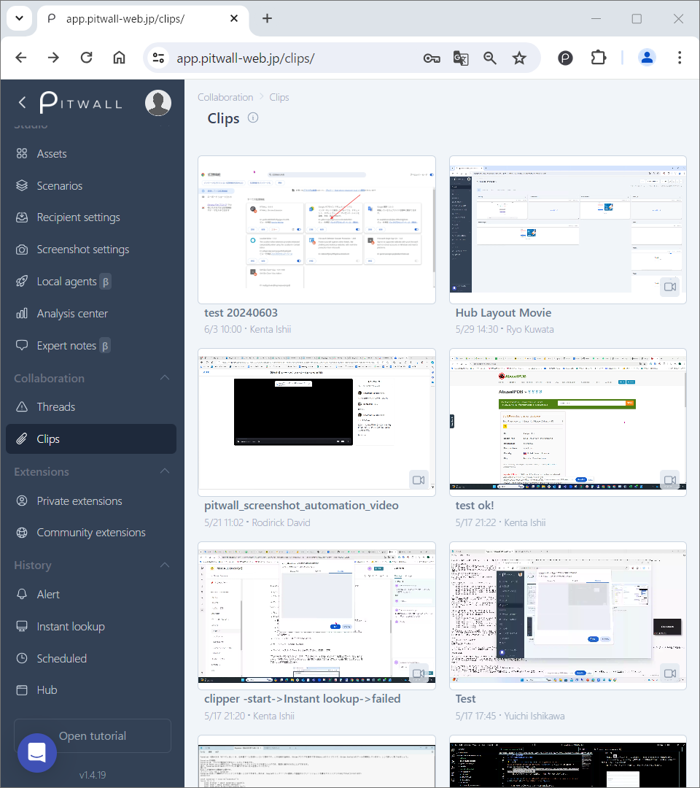
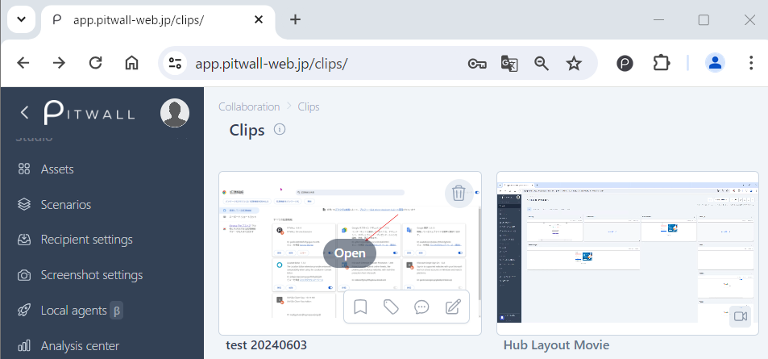

# What is Clips?
In the Clip view, you can store screenshots and movie files captured by scenarios or browser extension.

<figure></figure>

To directly modify Tags or Comments, hover the thumbnail, and click the quick menu to pop-up the dialog window.

<figure></figure>

## Tool menu for Screenshots
- : Opens an screenshot image. 

These tools are available for the sreenshot images after opening them. 

| Icons | Descriptions | 
| - | - | 
| Pin  | Pins to Clip view. |
| Add tags  | Adds tags for the screenshot. |
| Comment  | Comments additional notes. |
| Annotate  | Inserts characters and shapes. |
| Hide Annotations  | Hides your annotations. |
| Share link  | Copies the link of this screenshot to the clipboard.|
|  | Zooms in/out.|

-  - Deletes the screenshot from the Clip view. To delete the screenshots assigned to threads, you first need to delete them in Thread view. (Until then, such screenshots are protected.)

## Open Video files
-  - Opens a builtin video player.
-  - Deletes the video file from the Clip view. To delete the videos assigned to threads, you first need to delete them in Thread view. (Until then, such videos are protected.)
