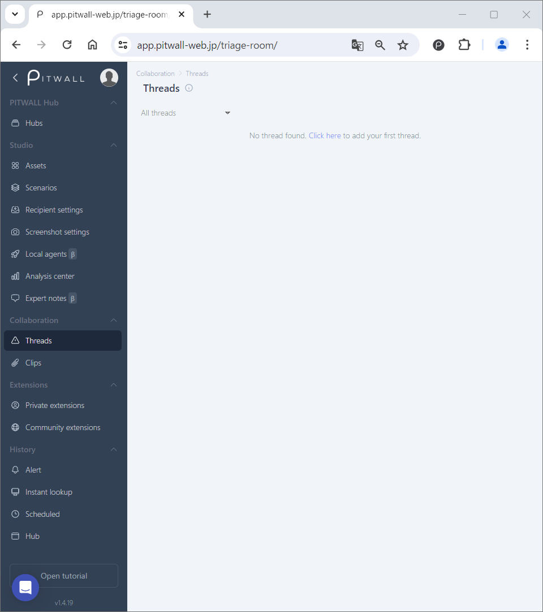
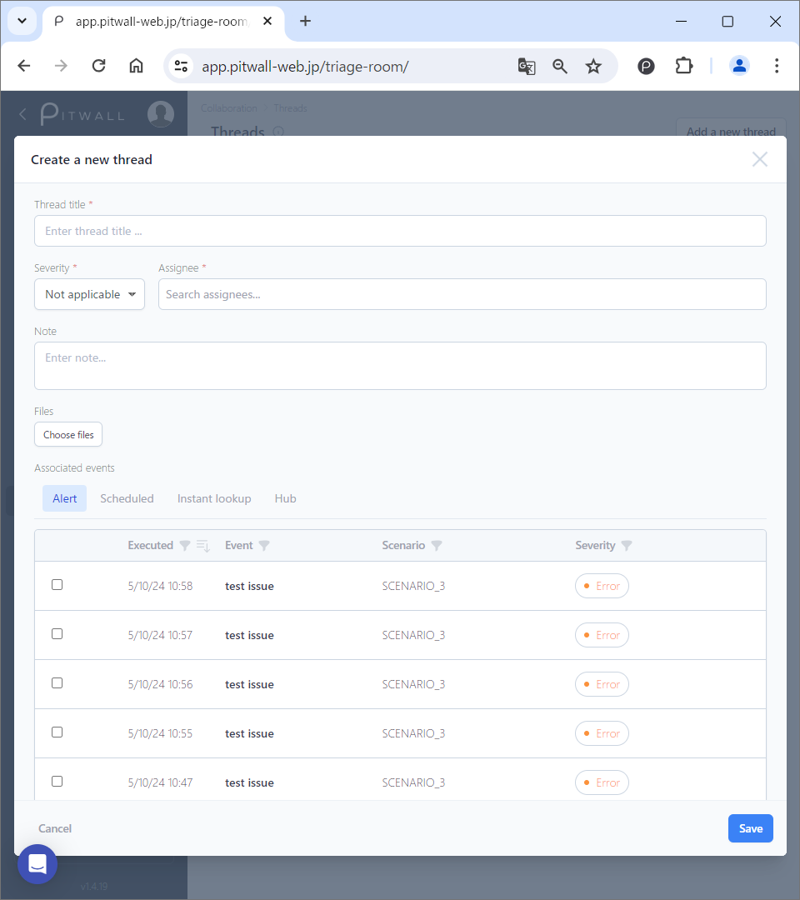

# Threads

## Thread management
Thread functionality serves various purposes in handling events as a team, designed to facilitate communication and collaboration among team members.

These are the fundamentals of thread management:
- Real-time communication: Threads allow team members to focus instantly on specific events to initiate actions.
- Information sharing: Team members can use threads to share the updates and relevant information.
- Adjustment of response methods: Easily accessible data help you adjust action strategies.

### Creating a new Thread
This is the default view of the threads:

<figure></figure>

There are two patterns for creating threads:

#### Pattern 1
Add thread from the modal window: [Create New Thread].

<figure></figure>

| Items | Descriptions |
| - | - |
| Thread title | Enter any thread title. |
| Severity | Select a number from 1 to 6 based on severity (1 being most severe, 6 being least severe). |
| Note | Use this field as a memo section. |
| Files | Attach local files or photos. |
| Associated Events | Four types of events can be associated:   - Alert   - Scheduled   - Instant Lookup   - Hub |

Click the [Save] button.

After adding the thread, the screen will appear as follows:

<figure></figure>

#### Pattern 2
Click [Create a thread] from the email notification from PITWALL, and then [Create New Thread] window will be prompt for thread registration. The related events in the notification email will be automatically assigned to associated events.

### Operating the Thread detail screen
Click the title of a registered thread on the Thread view for its details. The following actions can be performed from the thread detail screen:
- Add a new tab by clicking the gear icon or the [+] sign in the upper left corner.
- Add new clips, events, and files by clicking the [+] sign in the message field below.
- Add messages to the thread.
- Click [Events] in the upper right corner to view the list of associated events.
    - Click the associated event name to see detailed information about that event.
- Click [Clips] in the upper right corner to view images, videos, files, etc., attached to the thread.
- Click [History] in the upper right corner to review the thread's history.

### Editing, Deleting, and Closing Threads
> You can modify the following attributes of a thread from the vertical ellipsis   on the right side of the thread main screen. You can also edit them from the vertical ellipsis on the right side of the thread detail screen or by clicking [Edit Thread] in the upper right corner.

| Items | Descriptions |
| - | - |
| Title | Edit the thread title. |
| Severity | Edit the thread severity (1: most severe, 6: least severe). |
| Status | Edit the thread status (Open, Closed, RCA, RCA Completed). You can also edit it from the pull-down menu in the upper left corner of the thread detail screen. |
| Note | Add additional comments. |

> You can delete a thread from the vertical ellipsis   on the right side of the thread main screen.

###  Create a new Timeline / Edit the Timelines in the thread
Click the thread in Thread view. In the message box at the bottom, you can add a new timeline to the thread. Hover to each timeline to activate the quick menu:

| Icons | Descriptions |
| - | - |
|  | - Edits the comment. |
|  | - Adds clips (images, videos, etc.). |
|  | - Adds events. |
|  | - Uploads files. |
|  | - Deletes the timeline. |

Additionally, click the [+] button; to [Add clips], [Add events], [Upload files]. Alternatively, directly drag and drop the files to the message box to create a new timeline.