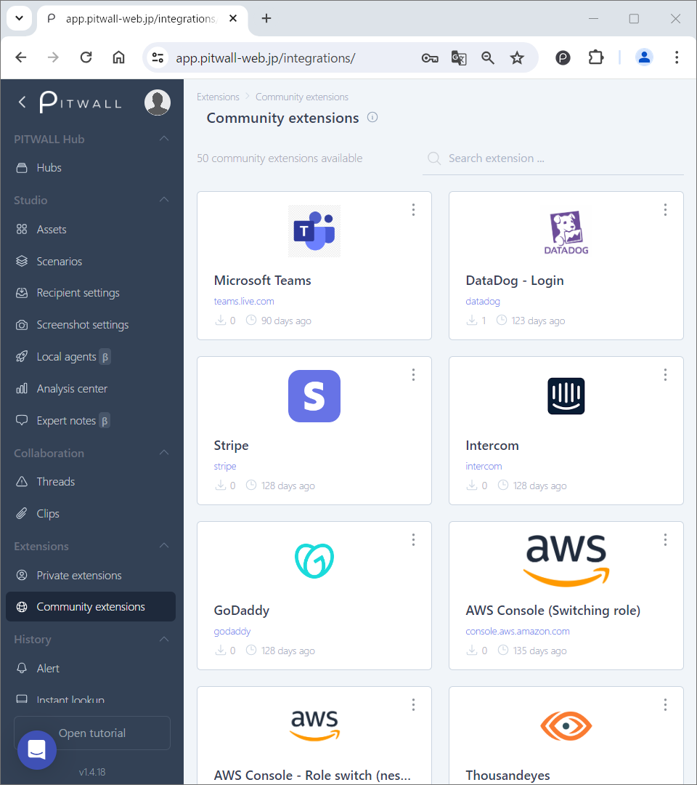

# Community extensions
<figure></figure>

Community extensions are pre-deployed or contributed by users.
The extension provides various contents like URLs, icons/logos, and timestamp formats. 

This extension automatically matches and discovers sites and tools from URLs. It is possible to display icons of detected services in various places, such as PITWALL's studio and list of functions, providing visual support for understanding the displayed information.

These extensions cannot be edited, but you can copy them to your private extensions by selecting [Clone this extension] from the vertical ellipsis  of the registered extensions.

You can click on any extension icon to see its configuration parameters.

If your scenario lacks an icon, consider contributing one for your better productivitiy.