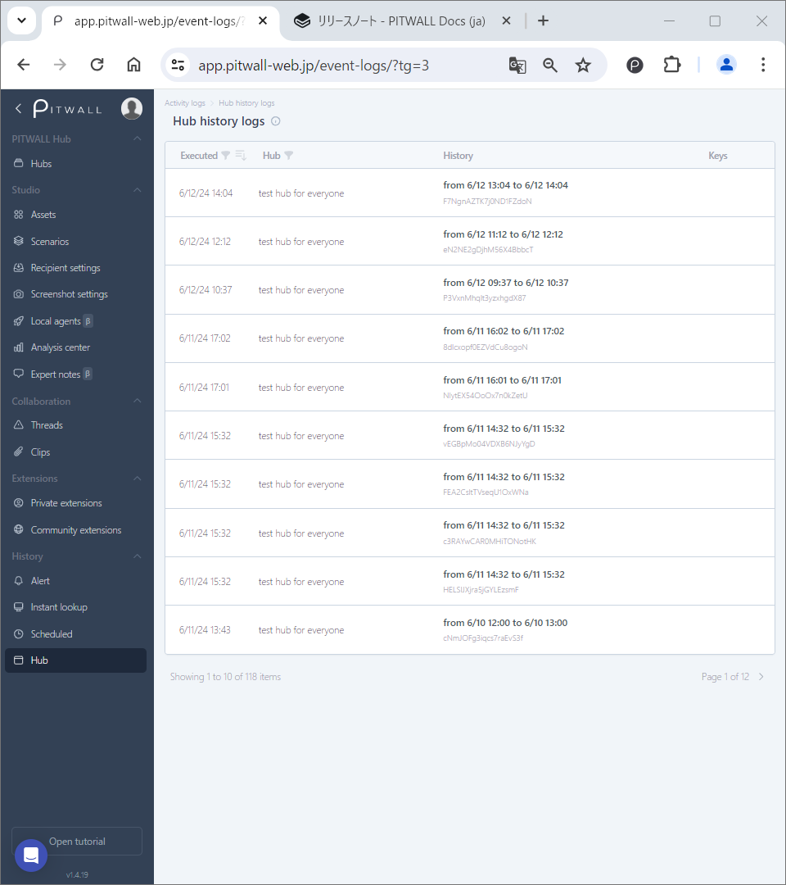

# Hub

<figure></figure>

## Hub history

In this history view, you can review the hubs added in the past; compare the events, add new tags, comments, and annotations. Also, this view will be helpful for your further analysis of events. Each _Record_ becomes a direct link to their _SnapView_.
- Executed: The last execution time.
- Hub: The name of hubs will be displayed.
- History: The date and execution time or activated timeframe will be displayed.
- Keys: The _key_ used will be displayed.