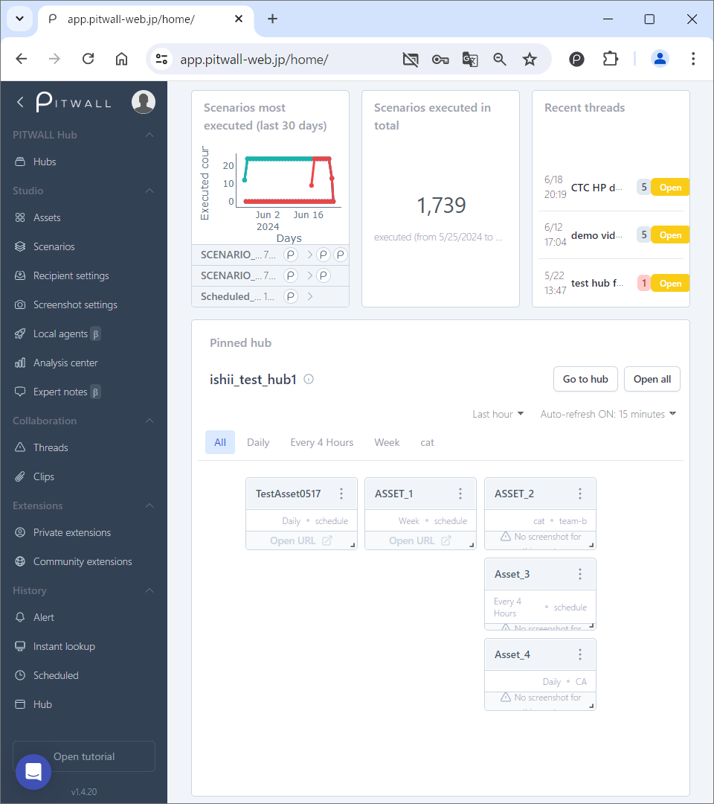

# Home

This page is displayed immediately after logging in. It is in a dashboard-like format where you can check the following information.

<figure></figure>

| Items                        | Descriptions   |
| :-                          | :-     |
|Most frequently executed scenarios   | A graph of the scenarios executed in the past 30 days is displayed.  The vertical axis is the number of times they were executed, and the horizontal axis is the date they were executed. Directly below the graph are the names of the executed scenarios and the number of times they were executed.  |
|Scenarios executed in total           | The total number of times the registered scenarios were executed is displayed.  |
|Recent threads               | The most recently created threads are displayed. |
|Pinned hubs                  | Hubs pinned on the hub page are pinned to the home page.   Go to hub: Go to the hub page.   Open all: All assets registered in the target hub are displyed in a new tab in the browser.   For more information on the hub features, please refer to the [Hub](tutorial-get-started/pitwall-hub/pitwall-hub.md) page. |