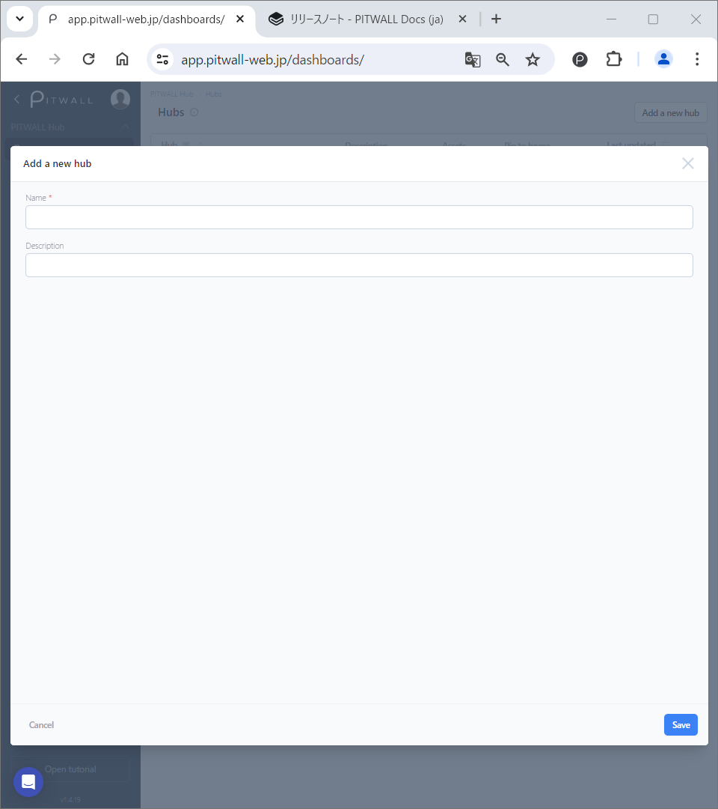
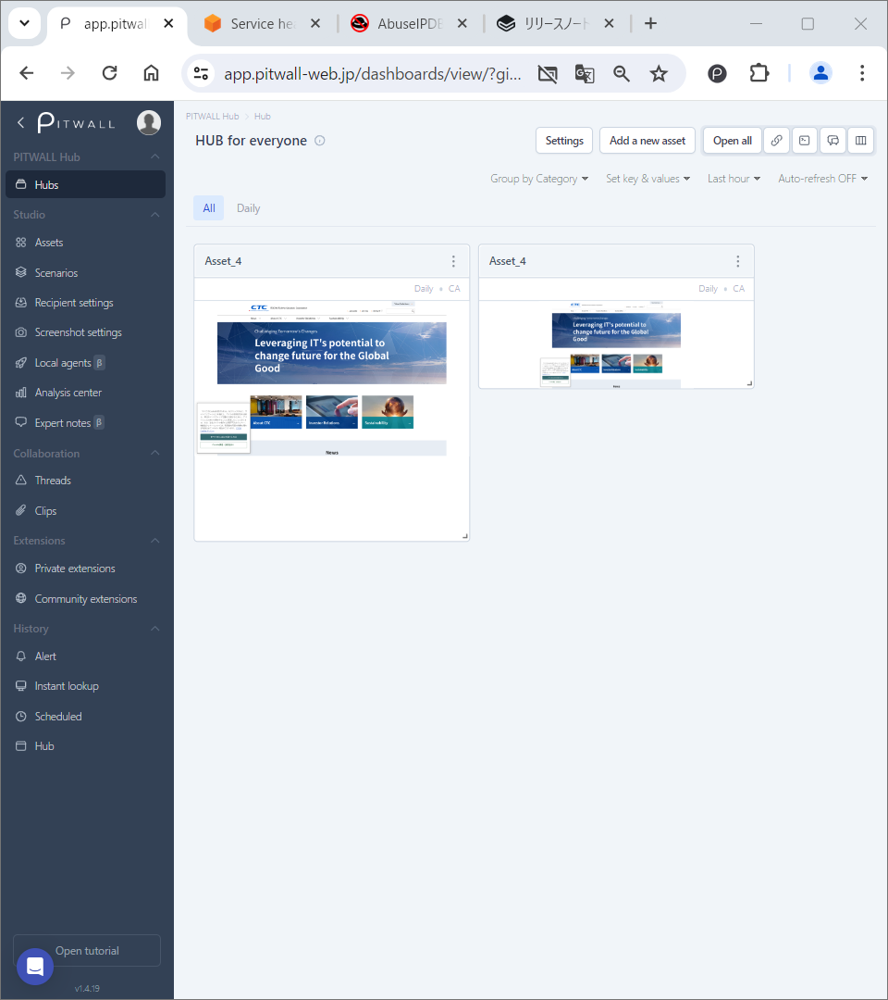

# Hub
You can create a new hub and view existing hubs. Each hub contains a set of assets. You can manage each hub, such as adding or deleting an asset from the group.

You can change the size and layout of displayed assets within the hub by using your mouse.

<figure><figcaption></figcaption></figure>

| Items     | Descriptions  |
|:---         | :--   |
|Hub          |The Name of the hub. By clicking the hub's name, you can edit the selected hub.  - Click the icon to filter the hubs.|
|Description  |The description of the hub.|
|Assets       |The number of Assets, registered for that hub.|
|Pin to home  |Pin or Unpin the hub.|
|Last updated |The latest date when the configuration was changed.  - Click the icon to sort the hubs in descending or ascending order.|
|Vertical ellipsis |&#9679; Edit this hub - to change configuration of the hub. &#9679; Start hub comparison - to analyze the assets in the hubs. &#9679; Delete this hub - to delete the hub.|

## Create a new Hub
Click the [Add a new hub] button to open the [Add a new hub] modal window, then fillout the following items. For further setups, move on to the next section [Manage the hub].<figure><figcaption></figcaption></figure>

| Options   | Descriptions  |
|:---| :--   
|Name      | - The name of the hub.|
|Description| - To add a simple description.|

## Manage the Hub

<figure></figure>

| Items | Descriptions |
|:---|:--|
|Settings       |Click this option to open [Manage hub settings] window. This option allows you to select members who can have the access to this hub.|
|Add a new asset|Add assets to this hub. &#9679;_Create a new asset_ - to assign new assets to the hub. &#9679;_Select existing assets_ - to assign existing assets to the hub. Each asset is sorted in categories.
|Open all       |All the assets assigned to the hub can be opened in new tabs at once. If two or more assets are assigned, your browser might block them as pop-ups.|
|| _Link_ icon - to copy the URL link of the hub.|
|| _Headline_ icon - to set a headline to the hub.|
|| _Thread_ icon - to directly create a thread from the hub.|
|| _Layout_ icon - to compare the each instance of hub, by checking the differences of the assets.   &#9679; In the "Manage hub comparison" window, you can also compare instances of different time frames or Key/Value sets. And, click [Add] button to output the comparison.|
<!--[要再翻訳]無理やり英語に直してあるが、現状、comparisonにKey/Valueは設定できないはず。-->

### Example presentaton:
<figure><figcaption></figcaption></figure>

## Change the layout

After you edit the hub and configure the information you want to display, you can enlarge and reposition each displayed asset with your mouse. <!--動画を入れたい-->



<video width="320" height="240" controls>
  <source src="https://github.com/pitwall-dev/pitwall-docs-ja/blob/main/.gitbook/assets/Hub_Layout_Sample.mp4" type="video/mp4">
</video>

