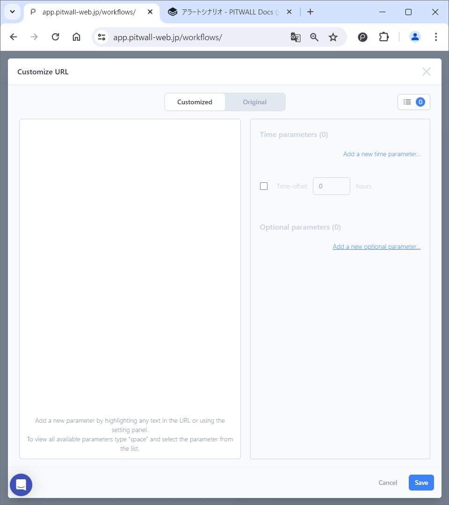

# Alert Scenario

Analyze the sites and tools that caused the alert. 
Click the [Build a new scenario] button, select the scenario title, summary, and scenario type, and then set the elements below. The steps below are for creating a scenario if you select [Build from scratch].

<figure></figure>

## Trigger Settings

Click the [Set a trigger] button to define the trigger for the scenario to be executed. Once you have finished entering the settings, click the [Save] button.

<figure></figure>

| Items                     | Descriptions  |
|:---                     | :--   |
|Title                  |Give your trigger any name.|
|Type                   |Select alert.|
|Select source service  |Select the service from which the alerts will be sent.|
|Alert body                |When you select a trigger service, a sample alert body is displayed. You can edit the alert body by hovering the mouse over the displayed alert body. ● Manage alert body: If the payload sent by the alert is customized, you can edit the alert body. |
|Add Custom keys        |You can add custom parameters to the default alert body. See the steps below for more information. |

### Adding Custom Key
Click the [Add a Custom key] button and the following modal window will appear.

<figure></figure>

#### １．Settings
| Items                          | Descriptions  |
|:---                           | :--   |
|Key Name                         |Give your custom key a name. All custom key names will be prefixed with the string "pw_custom_".
|Select what to parse                 |Select the key of the payload to parse with the custom key. |
|Add new inference sample |Paste a sample payload, select a value corresponding to the custom key, and click [Add new inference sample] to add a sample.  <figure></figure>  ● Paste sample payload： Paste the sample payload.  ● Extract selected value： Highlight the value you want to extract from the pasted sample payload with the custom key. Click the [Extract selected value] button and the value will be displayed in the [target value].  ● Add sample：Add a sample payload. |
| | |

#### ２．Validate
| Items                                 | Descriptions  |
|:---                                  | :--   |
|Add new test sample    | Click [Add new test sample] button to validate the regular expression you created. <figure></figure> ● Paste sample payload： Enter a sample payload. ● Highlight the value you want to extract from the pasted sample payload with a custom key. Click the [Extract selected value] button and the value will be displayed in Target value.  ● Target value： The target value is displayed ● Add sample： Add a new sample. |
|Test regex extraction                  | Verify whether extraction is possible using regular expressions.
|Result                                  | Displays the value extracted from the test payload by applying a regular expression.

## Lookup Settings

Click [Add a new lookup] to define the data (dashboard, tool, console, etc.) to be retrieved when an event occurs. This is the main part of the scenario. Register the following items and click the [Save] button.

<figure></figure>

### Settings

| Items                 | Descriptions  |
|:---                   | :--   |
|Setup method           |Set the lookup method. If the lookup target is registered as an asset, you can access it using the method registered in the asset by selecting the asset from the pull-down list. |
|Title                  | Enter any lookup title. |
|Lookup group      | Select a lookup group. |
|Add a lookup group  | Click to group the lookup target. When the [Manage Scenario Settings] modal screen is displayed, enter a new lookup group name in the "Lookup Groups" tab and click the [Save] button. |
|URL                       | Enter the URL of the data you want to lookup, such as (dashboard, view, console, etc.). |
|Click to customize  | Part of the URL to be looked up is parameterized. Clicking this will display a modal screen called [Customize URL]. Customization increases versatility by recognizing part of the URL as a variable. |
|Service automatically detected   | Displays the service that was automatically detected from the URL entered in the URL field. Even if the target site is not automatically detected, there is no functional impact. You can add visual aids (icons in the scenario, etc.) by installing an extension. |
|Connected from(source)          | The trigger name is displayed. |
|Expert note        | You can assign an expert note created by an expert. |

### Customize URL
Click [Click to Customize] and below modal screen will be displayed.

<figure></figure>

Paste the URL you want to customize in the left pane of the modal screen. Highlight the parameter you want to customize with your mouse and select a key. You can also set a custom key that you created when setting up the trigger.
  
You can also configure it from the settings panel on the right pane.
- Time parameters： The time parameter that was set is displayed.
    - Add a new time parameter: Click to add a new time parameter.
        - Set-up time parameter： Select the time format you want to recognize in the URL. When you select the format, the regular expression will be displayed at the bottom. After entering a label, click the [Add Now] button to save it. 
    - Time-offset： Check the box to enable it. You can set the time to determine the time range.
- Option parameters： The option parameter that was set is displayed.
    - Add new option parameter： Used to parameterize strings other than times.
        - Set-up option parameter: Set the parameters you want to add and save.
            - Copy and paste the string you want to parameterize from the URL into the top text box.
            - In the bottom text box, select the payload parameters.

## Recipient Settings

Click [Manage recipients] and set the destinations to notify of the information collected by lookup. If you want to set a notification destination registered in PITWALL, search for the target notification destination in the input field. If you want to register and set a new recipient, register and set the name and notification destination. You can set multiple notification destinations. You can set Email, Slack, and Teams as notification destinations. For details, refer to the [Set notification address](tutorial-get-started/studio/recipient-settings.md) manual.

<figure></figure>