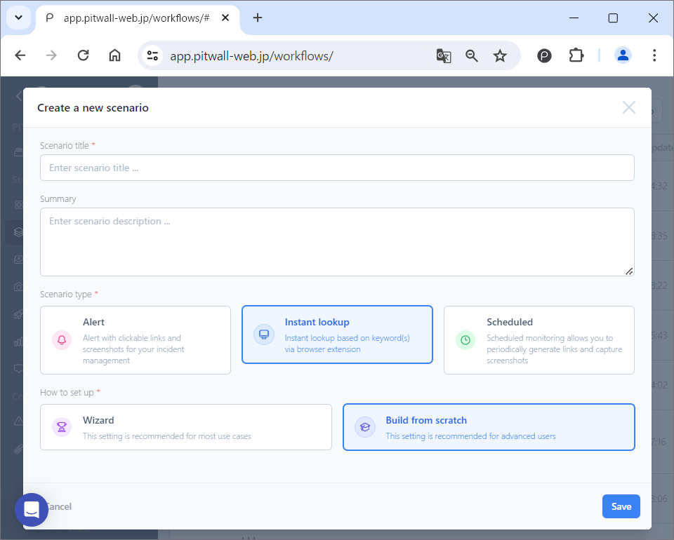
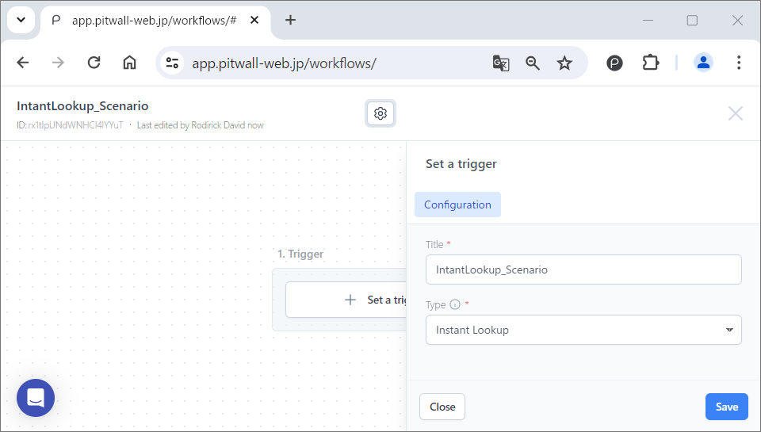
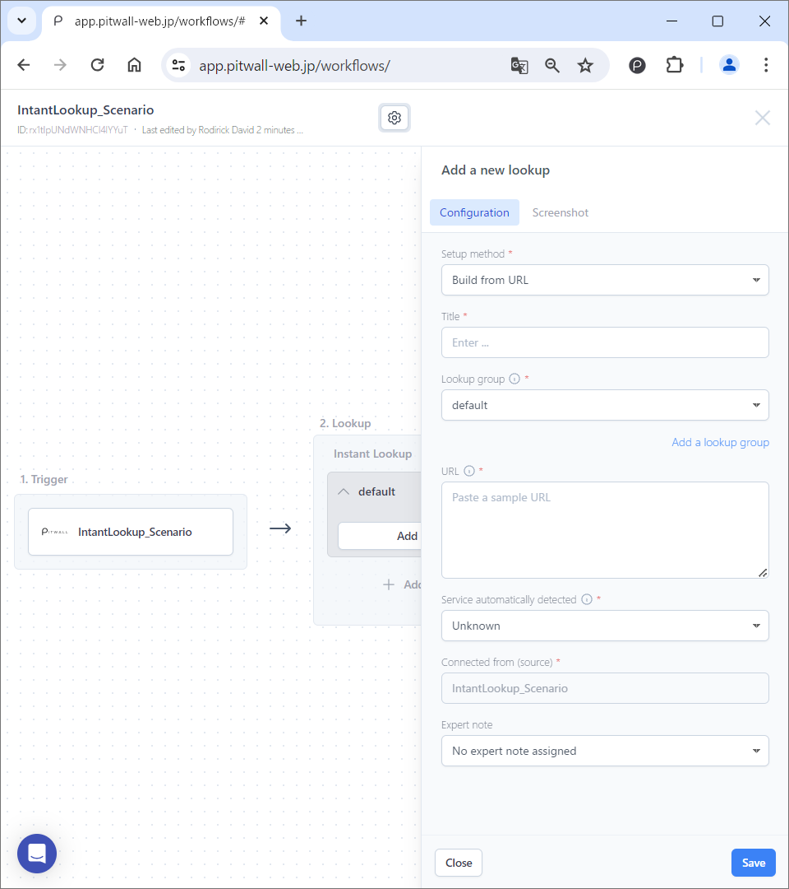
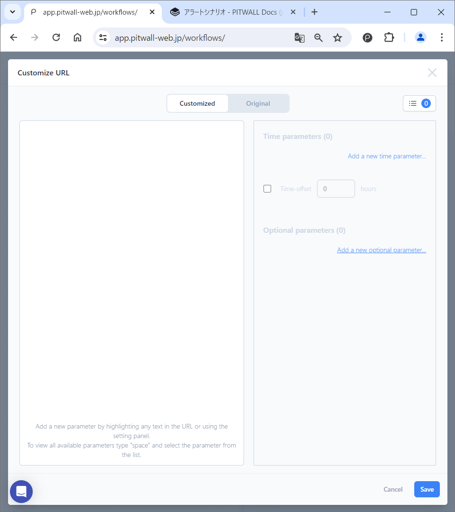
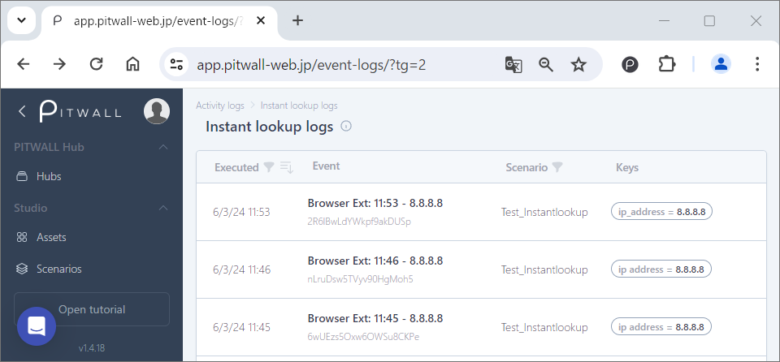

# Instant Lookup Scenario
Creating instant lookup scenario lets you look up assets based on one or more keywords. Instant Lookup uses browser extensions to analyze sites and tools on demand.  
Below are the steps to create a scenario using [Build from scratch].

<figure></figure>

## Trigger Settings
Click on the [Set a trigger] button to define the trigger that will execute the scenario. For instant lookup scenarios, the trigger is a browser extension.

<figure></figure>

| Items       | Descriptions  |
|:---        | :--   |
|Title    |Enter a name for the trigger|
|Type      |Select instant lookup|

## Lookup Settings
Click [Add a new lookup] to define the data (dashboard, tool, console, etc.) that you want to capture when the event occurs. This function is the part of the scenario. Register the following items and click on the [Save] button.

<figure></figure>

### Settings
| Items                     | Descriptions  |
|:---                      | :--   |
|Setup method          |Set a lookup method. If the lookup target is registered as an asset, select the asset from the pull-down list to access it using the method registered for the asset.
|Title                  |Enter a name for lookup settings
|Lookup group      |Select a lookup group
|Add a lookup group  |Click to group the lookup target. When the [Manage Scenario Settings] modal screen is displayed, enter a new lookup group name in the "Lookup Groups" tab and click the [Save] button. | 
|URL                       |Enter the URL of the data you want to look up (dashboard, view, console, etc.).
|Click to customize  |Parameterize (make variable) a portion of the URL to be looked up. Upon clicking, a modal screen called “Customize URL” will appear. Customize increases versatility by recognizing a portion of the URL as a variable.
|Service automatically detected   |Displays the service which is automatically detected from the URL entered in the URL field. Even if the target site is not automatically detected, there is no functional impact. Visual aids (e.g. icons in the scenario) can be added by installing an extension.
|Connected from（Source）          |Displays the trigger name.
|Expert note        |You can assign an expert note created by an expert.

### Customize URL
Clicking on [Click to customize] will display a modal screen as shown below. 
<figure></figure>
Paste the URL you would like to customize into the left pane of the modal screen. Highlight the parameter you would like to customize with a mouse and select the key.  You can also set the custom key that you have created when setting the trigger.  
  
You can also set it from the settings panel on the right pane.
- Time Parameters：Displays the set time parameters.
    - Add a new time parameter：Click to set new time parameters.
        - Set-up time parameter：Select the time format to be recognized in the URL. Once you select the format, the regular expression will be displayed at the bottom. After entering an optional label, click the [Add now] button to save.
    - Time-offset：Check the box to enable. By setting the time, you can determine the time range.
- Optional Parameters：The configured optional parameters are displayed. By parameterizing part of the URL, you can make it generalized as shown below.
    - Add a new optional parameter：Used when parameterizing strings other than time.
        - Set-up optional parameter：Set the parameters to be added and save.
            - Copy and paste the string you want to parameterize from the URL into the upper text box.
            - Select payload parameters in the lower text box.

## How to use instant lookup scenario
Prerequisite：Instant lookup scenario is set up. The address to be looked up has been customized and changed to variable.
|||
|:---                      | :--   |
|Original URL|https://www.abuseipdb.com/check/183.79.248.124|
|Customized URL|https://www.abuseipdb.com/check/${ip_address}|

Browser extension function  Icon > Select Instant lookup

<figure></figure>

1. Select the scenario that you would like to run from the scenario pull-down menu.
2. Select the target to be looked up from the lookup pull-down menu.
3. Enter the target IP address that you would like to lookup in the variable parameter in [Customize URL] (#URLcustomize).
4. Click on Take screenshot button.   When you click the Find button, the URL of the [Asset] set in the scenario lookup is displayed.
5. When you take a screenshot in the instant lookup scenario, the history page will keep the records of the history of the execution.
<figure></figure>

6. By clicking on the record of the most recent instant lookup on the history page, you can easily compare and analyze the historical information.

<figure></figure>

## Recipient Settings
Instant lookups cannot be set to notify recipients. When you run an instant lookup scenario, check the execution history from History > Instant lookup.
