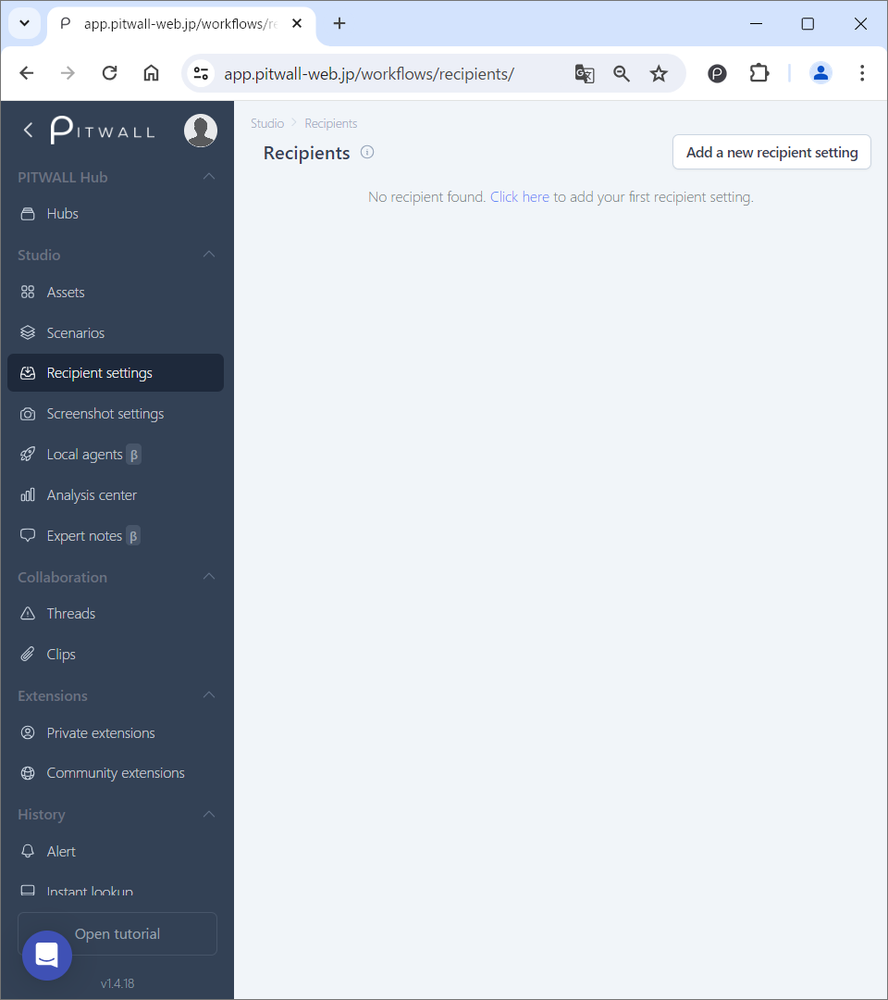
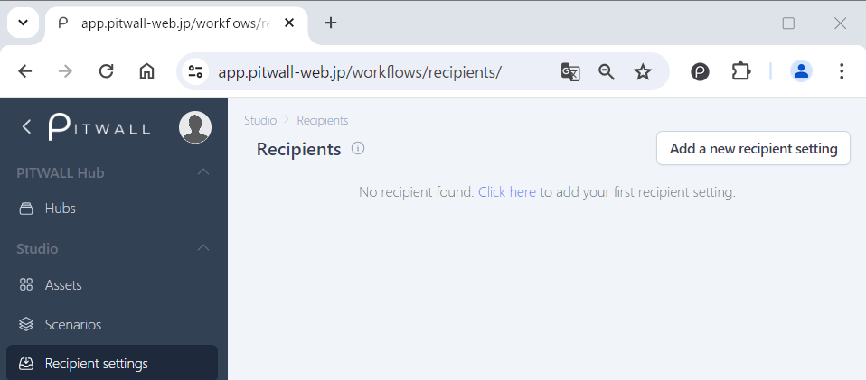
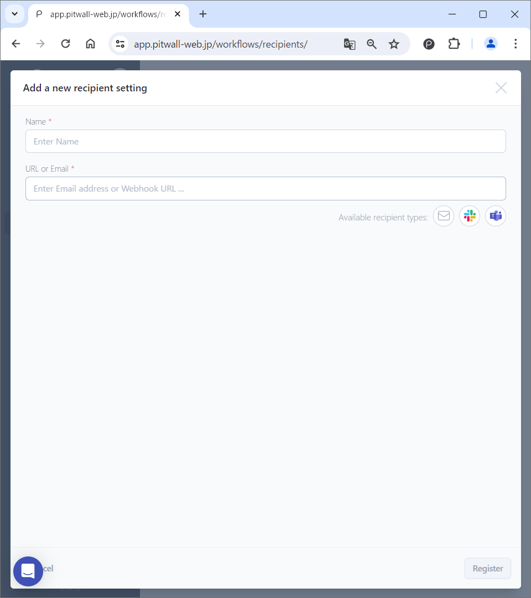

# Recipient settings

## What is Recipient settings?
By configuring recipient settings, you can send notifications about the results of executed scenario.

## How to use

The default screen will look like this.

<figure></figure>

### Register recipient
Click the [Add a new recipient setting] button in the upper right.

<figure></figure>

Register recipient information from [Add a new recipient setting] on the modal window.

<figure></figure>

- Name: You can set any name for the recipient. (3 characters or more is required)
- URL or Email: Enter a Webhook URL or Email address. Currently available recipients are Email, Slack, and Teams.

Click on [Register] button.

### Screen after registering the recipient
Once you have set up the recipient, the registered recipient will be displayed in a list.

<figure></figure>

| Items | Descriptions |
| - | - |
| Recipient |  Recipient names will be displayed.|
| Scenarios | This is the number of scenarios for which the relevant recipient is set. |
| Registered | The date and time when the recipient was registered.|
| Last updated | The date and time when the recipient was last updated. |

### Edit recipient
To edit a recipient, click on the recipient's name or select [Manage recipient] from the vertical ellipsis . Once selected, the editing screen will be displayed.

### Delete recipient
To delete a notification recipient, click the vertical ellipsis  and select [Delete recipient].
If you are sure you want to delete it, click the Delete button to confirm.
If a recipient is set in a scenario, you cannot delete the recipient. You must first delete the recipient from the scenario.
