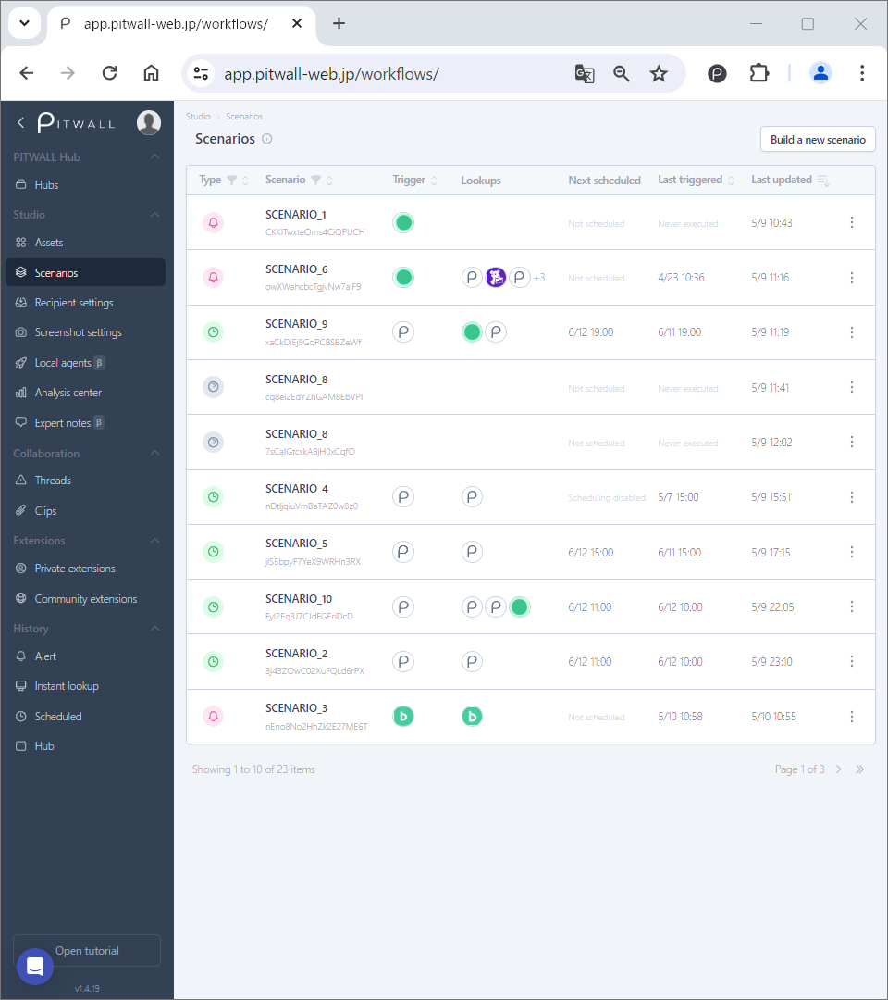
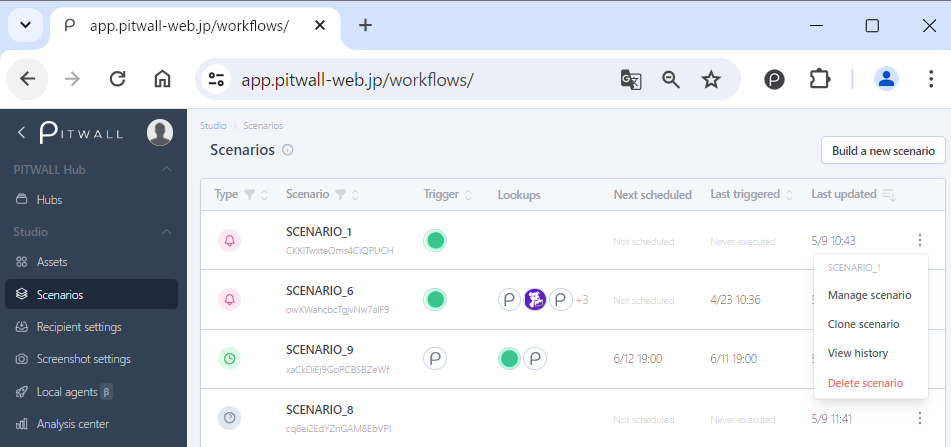
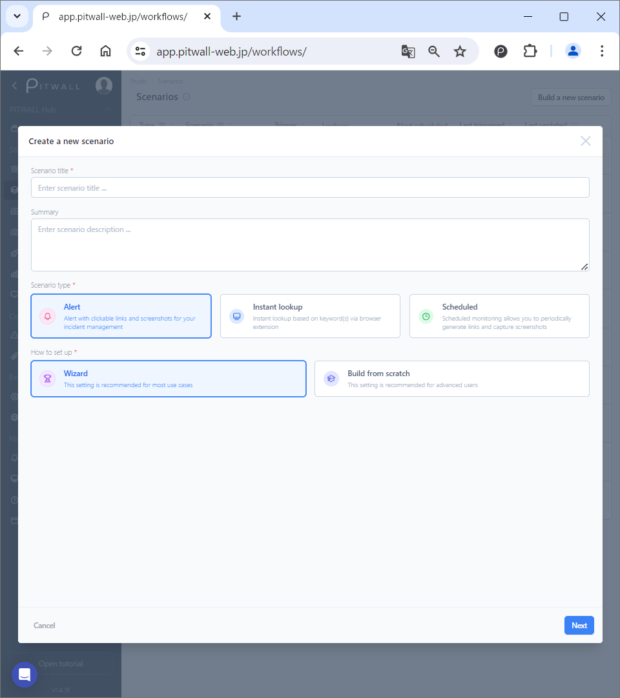
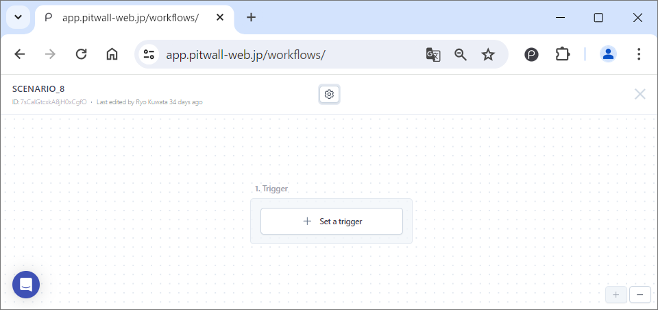

# Scenarios

## What is Scenario?
The Scenario defines the corresponding process of PITWALL, parallelizes the information you want to obtain, and visualizes the end of the process to help you smoothly understand the current situation. Each scenario is a flowchart, and each element is set within the flowchart. For example, when creating a new scenario triggered by an alert, the scenario is composed of elements such as [trigger], [lookup], and [recipient], and you set the destination where information will be collected and sent when an event occurs. If multiple alerts require the same data lookup, you can use the same scenario for them.

## Scenarios
You can create a new scenario and display a list of scenarios that have been created.
<figure></figure>  

### Create a new Scenario
Click the [Build a new scenario] button to go to the page for creating a new scenario. For instructions on how to create a scenario, go to the [New scenario creation](#NewScenarioCreation) procedure.

### List of Scenarios
You can view a list of registered scenarios.
| Items                     | Descriptions                                                      |
| -                        | -                                                         |
|Type                    |The scenario type is displayed with an icon. **Alert scenario**:  Displayed with a red icon. **Instant lookup scenario**:  Displayed with a blue icon. **Scheduled scenario**:  Displayed with a green icon. **Not set**:  Displayed with a gray icon.|
|Scenario                  |The scenario name will be displayed. The string displayed just below the scenario name is the scenario ID. Clicking the scenario ID allows you to copy the PITWALL endpoint URL that includes the scenario ID.|
|Trigger                  |The trigger (service) set for the corresponding scenario is displayed as an icon. This is the element that causes the scenario to be executed.|
|Lookups              |The icon of the lookup target is displayed. When you hover the mouse over the icon, the name of the lookup target service is displayed.|
|Next scheduled                |For scenarios that are set to run periodically, the next scenario execution date and time is displayed.|
|Last triggered  |Displays the date and time when the target scenario was last executed.|
|Last updated              |Displays the date and time when the target scenario was last updated.|

### Menu for Scenarios
Clicking on the vertical ellipsis  of a scenario will display a menu of options that can be executed for that scenario.
<figure></figure>

| Items                     | Descriptions                                                      |
| -                        | -                                                         |
|Manage scenario            |You will be redirected to the scenario editing page.|
|Run scenario            |Manually execute the configured scenario.|
|Clone scenario    |Create a copy of the scenario. Cloned scenarios will have the string [Copy] added to the end of the scenario name.|
|View history                |You can check the history of scenario execution (activity log).|
|Delete scenario        |Delete the scenario. Once a scenario is deleted, it cannot be restored.|

## New Scenario creation
When you click the [Build a new scenario] button, a modal window will appear. Enter the following four items and click the [Save] button. All items are required.
<figure></figure>

| Items                     | Descriptions                                                      |
| -                        | -   |
|Scenario title          |Give your scenario any name.|
|Summary                      |Enter a summary of the scenario. The summary of the scenario must be at least 10 characters long.|
|Scenario type           |Select one of three types: Alert, Instant lookup, Scheduled.  **Alert**: Analyze the site or tool that caused the alert.  **Instant lookup**: Use browser extensions to analyze sites and tools on-demand based on keywords.  **Scheduled**: Regularly analyze sites and tools.|
|How to set up                  |**Wizard**: Follow the guidance to set up your scenario.   **Build from scratch**: Manually configure each element of the scenario.|

## Scenario flow chart
<figure></figure>

When you save a new scenario by [Build from scratch], a blank canvas will appear. For scenario configuration, proceed to the configuration instructions for each scenario type.
- Manage scenario settings: Click the gear icon in the center of the canvas to display a modal window called [Manage scenario settings]. In the modal window that appears, edit the Scenario title and summary.
- ID: The string displayed in the upper left corner of the flowchart is the scenario ID. By clicking the scenario ID, you can copy the PITWALL endpoint URL that includes the scenario ID.
- Last edited by: Displays the account that last edited the scenario and the time it was edited.
