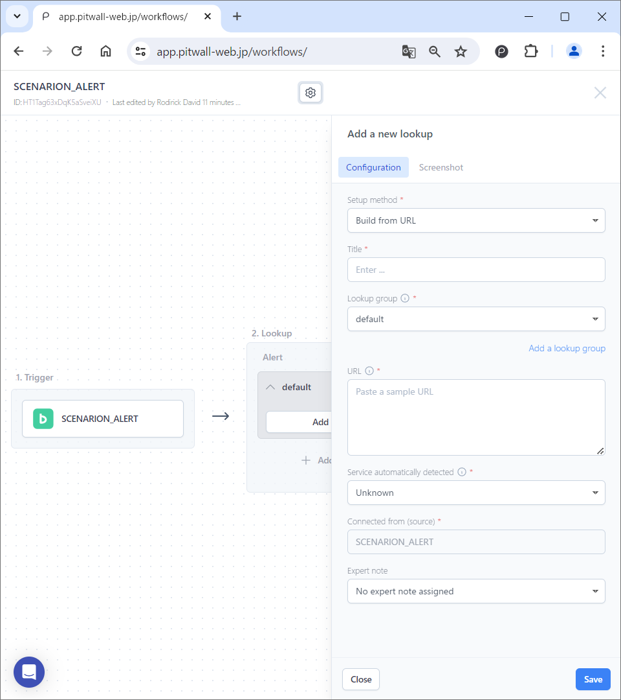

# Scheduled Scenario
 Creating a scheduled scenario allows you to monitor assets on a regular basis.
The following steps are for creating a scenario when you select [Build from scratch].<figure></figure>

## Trigger Settings
Click the [Set a trigger] button and define the trigger for executing the scenario. For scheduled execution, set the time interval for executing the scenario.<figure></figure>

| Items                           | Descriptions  |
|:---                            | :--   |
|Title                        |Give your trigger any name you like.|
|Type                          |Select [Scheduled Monitoring].|
|Enable this scenario?  |Move the toggle to enable.|
|Cron schedule expression              |Specify the periodic execution time in Linux Cron format. When you click the control icon at the right side of the text box, a pop-up window will appear, so specify the periodic execution schedule and save it by clicking the [Create Cron] button. For instructions on how to set up Cron, please see the [How to set up Cron] section below.|
|Next scheduled                    |When you hover the mouse over the setting, the next execution date and time of the Cron setting will be displayed.|
|Timezone                    |The scenario will be executed based on the time zone you set.|
|Correlation key & values                   |Set the key and value to be used when you lookup in a scheduled scenario. ● Key: Enter key.  ● Value: Enter value.|

### How to set up Cron 
<figure></figure>

| Items               | Descriptions  |
|:---                | :--   |
|Specify interval            |To set a scenario using only a time interval, click the [Every] radio button and specify the time interval for scenario execution from the pull-down list.
|Specify date and time            |Specify the date and time to run the scenario. Click the radio button on the right to specify the date and time to run the scenario.  **hours of day**: Specify the scenario execution time on a daily basis. Enter the number of the time you want to execute the task in 24-hour format. If you want to execute the task multiple times, separate the times with commas. To run every day at 2am and 2pm, enter "2,14".      **days of month**: Specify the date and time for the scenario to be executed monthly. ● Run at the hour(s): Enter the number of the time you want to execute the task in 24-hour format. If you want to execute the task multiple times, separate the times with commas. ● Run at the day(s) of the month: Enter the date you want to run the task in numbers. If you want to run the task on the 1st and 12th of every month, enter "1,12". To execute the task multiple times, separate the times with commas.   **days of week**: Specify the scenario execution date and time on a weekly basis. ● Run at the hour(s): Enter the number of the time you want to execute the task in 24-hour format. If you want to execute the task multiple times, separate the times with commas. ● Run at the day(s) of the week: Specify the day of the week to execute. You can set multiple days of the week.
|Enable manual edit  |Clicking this will allow you to manually enter the Cron expression for scheduled execution into the text box.

## Lookup Settings
Click [Add a new lookup] and define the data (dashboard, tool, console, etc.) to be acquired when an event occurs. This is the main part of the scenario. Register the following items and click the Save button.<figure></figure>
### Settings
| Items                     | Descriptions  |
|:---                      | :--   |
|Setup method            |Set the lookup method. If the lookup target is registered as an asset, you can access it using the method registered in the asset by selecting the asset from the pull-down list.
|Title                  |Give your lookup setting any name you like.
|Lookup group      |Select the lookup group.
|Add a lookup group  |Click to group the lookup target. When the [Manage Scenario Settings] modal screen is displayed, enter a new lookup group name in the "Lookup Groups" tab and click the [Save] button.
|URL                       |Enter the URL of the data you want to look up (dashboard, view, console, etc.).
|Click to customize  |This parameterizes part of the URL to be looked up. When you click this, a modal window called [Customize URL] will appear. Customization increases versatility by recognizing part of the URL as a variable.
|Service automatically detected    |Displays services that are automatically detected from the URL entered in the URL field. Even if the target site is not automatically detected, there is no functional impact. You can add visual aids (icons in the scenario, etc.) by installing an extension.
|Connected from (Source)          |The trigger name is displayed.
|Expert note        | You can assign an expert note created by an expert. |
  
### Customize URL
When you click on [Click to customize], a modal window like the one below will appear.<figure></figure>
Paste the URL you want to customize in the left pane of the modal window. Highlight the parameter you want to customize with your mouse and select a key. You can also set a custom key that you created when setting the trigger.
  
You can also configure it from the settings panel on the right pane.
- Time parameters: The time parameters that have been set are displayed.
    - Add a new time parameter: Click to set new time parameters.
        - Set-up time parameter: Select the time format you want to recognize in the URL. When you select the format, the regular expression will be displayed at the bottom. After entering a label, click the [Add now] button to save.
    - Time-offset: Check the box to enable. By setting the time, you can determine the time range.
- Optional parameters: The configured option parameters are displayed.
    - Add a new optional parameter: Used to parameterize strings other than times.
        - Set-up optional parameter: Set the parameters you want to add and save.
            - Copy and paste the string you want to parameterize from the URL into the top text box.
            - In the bottom text box, select the payload parameters.
## Recipient Settings
Click [Manage recipients] and set the destinations to notify of the information collected by lookup. If you want to set a notification destination registered in PITWALL, search for the target notification destination in the input field. If you want to register and set a new recipient, register and set the name and notification destination. You can set multiple notification destinations. You can set Email, Slack, and Teams as notification destinations. For details, refer to the [Set notification address](tutorial-get-started/studio/recipient-settings.md) manual.