# Browser automation 
By automating the browser, it is possible to simulate the browser operations performed by the user and automatically take screenshots.
For example, if you want to automatically enter your username and password on a site that requires user authentication and take a screenshot after logging in.
Another example is when you want to automatically search a word on a site, and take a screenshot after the screen transitions, the browser automation function is very useful.

## Creating new automation
To automate the browser and take screenshots, you need to create a new automation.
The following is an example of automating the browser, simulating the user's browser operations, and then take the screenshots.

Click on [create a new automation]. Set the screenshot flow as follows in [Update screenshot flow] on the modal screen. If you would like to preview the flow while creating it, 
click on [Preview this flow] button on the right pane of the screen.




Entering your username and password on PITWALL login screen and taking a screenshot after logging in.

**Step１: Accessing to URL**
   
1. Set [Function] to [Go to (Go to a specific page)].
2. Set [Argument] to [Built-in (Select from built-in)]. 
3. Set [Built-in variable] to [URL (Use generated URL)].
4. Click on [Done].

<figure>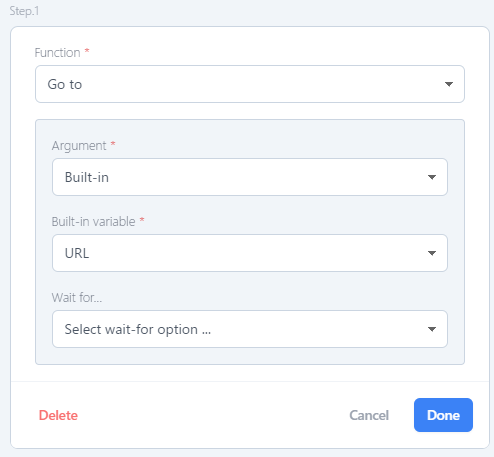</figure>

**Step２: Entering the email address in the email field after transiting to the URL.**

1. Set [Function] to [Type (Simulate user's typing activity)].
2. Set [Argument] to [Selector(CSS Selector)].
3. Set [Value] to`#email-address`. [※Refer to below for how to obtain value.](./#How to obtain [value])
4. Set [Wait for] to [Wait until(Wait until a certain event)].
5. Set [Life Cycle] to [Network Idle 2(Network Idle2)].  
6. Set [Argument] to [Built-in(Select from built-in)].
7. Set [Built-in variable] to [Username (Set in screenshot settings)].
8. Click on [Done].

#### How to obtain [value]
-  Open the PITWALL login page, right-click in the email field, and select [Verify]. <figure>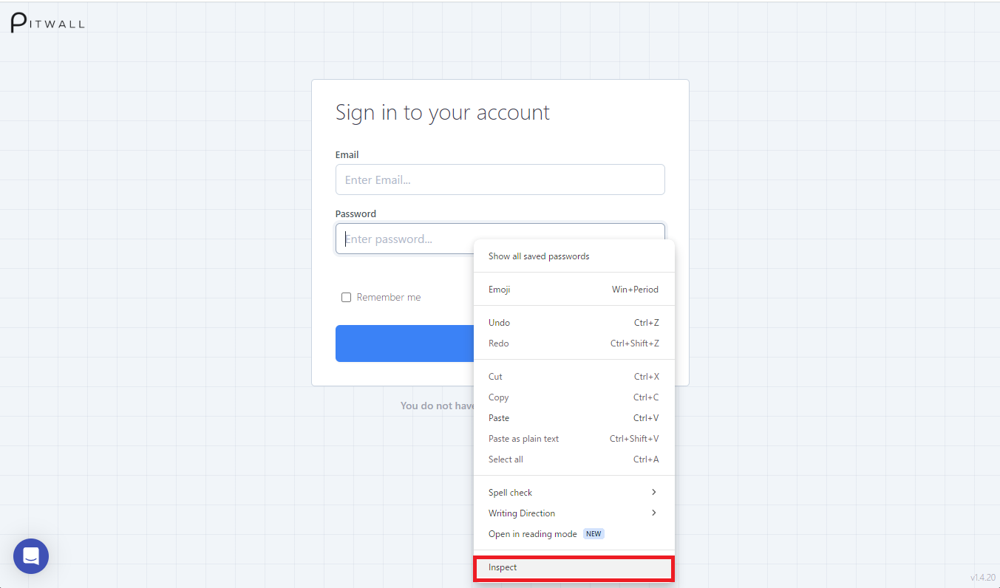</figure>

- Right click on the highlighted area in the elements tab of devtools and select Copy Selector. <figure>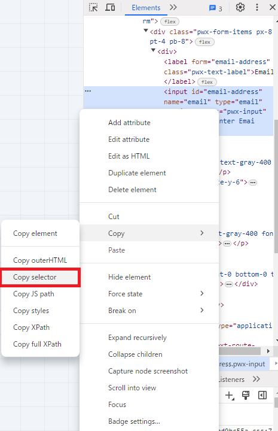</figure>

- Paste the selection made with Copy Selector into the [Value] field. (Paste it and it becomes `#email-address` in this case). <figure>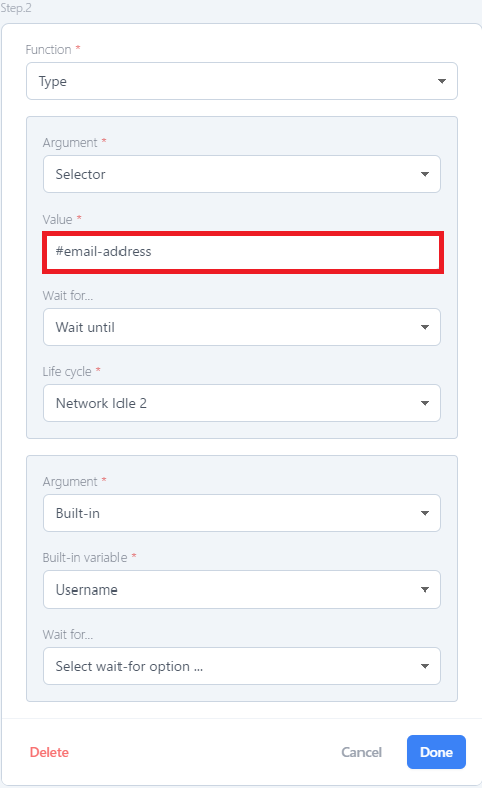</figure>

**Step３: Enter the password in the password field after the URL transition**

1. Set [Function] to [Type (Simulate user's typing activity)].
2. Set [Argument] to[Selector(CSS Selector)].
3. Set [Value] to`#password`. [※Refer to below for how to obtain value.](./#How to obtain [value])
4. Set [Wait for] to [Wait until(Wait until a certain event)].        
5. Set [Life Cycle] to [Network Idle 2(Network Idle2)].          
6. Set [Argument] to [Built-in(Select from built-in)].     
7. Set [Built-in variable] to [Password (Set in screenshot settings)].        
8. Click on [Done].

  
#### How to obtain [value]
- Open the PITWALL login page, right-click in the password field, and select [Verify].
<figure></figure>

- Right-click on the highlighted part of the elements tab of devtools and select Copy Selector.
<figure>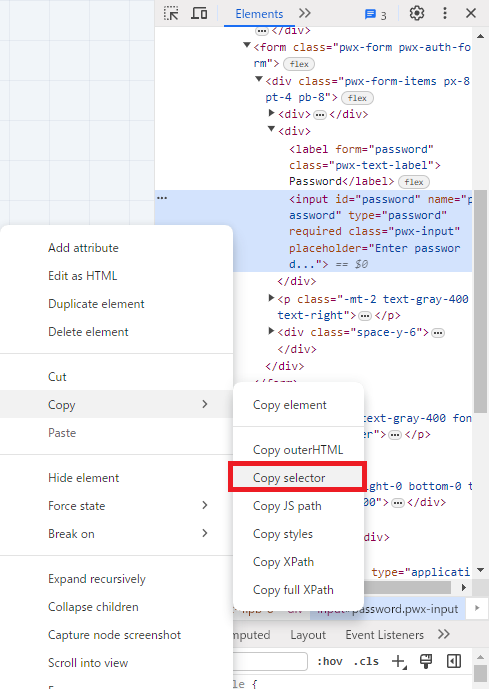</figure>

- Paste the selection made with Copy Selector into the [Value] field.(Paste it and it becomes `#password` in this case).
<figure>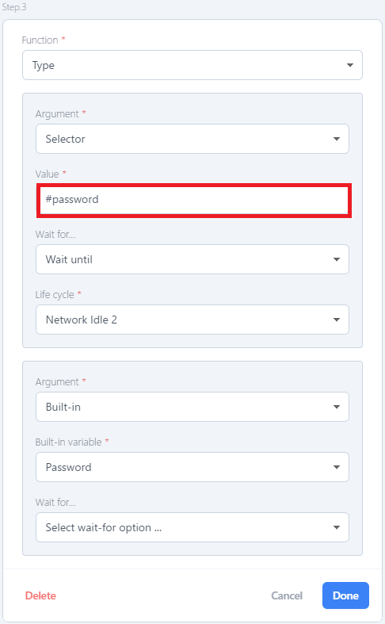</figure>

**Step４: Click on signin button**

1. Set [Function] to [Click(Simulate user's clicking activity)].
2. Set [Argument] to [Selector(CSS Selector)].
3. Set [Value] to `#__next > div.relative.w-full.h-screen.flex.flex-col.align-center.justify-center.pwx-auth-bg-color > div.flex.grow.pt-8.pb-16.items-start.justify-center.gap-2.overflow-scroll > div > div > form > div > div.space-y-6 > div > button` [※Refer to below for how to obtain value.](./#How to obtain [value])
4. Set [Wait for] to [Wait until(Wait until a certain event)].   
5. Set [Life Cycle] to [Network Idle 2(Network Idle2)].     
6. Click on [Done].

#### How to obtain [value]
- Open the PITWALL login page, right-click on the [signin] button, and select [Verify]. 
<figure>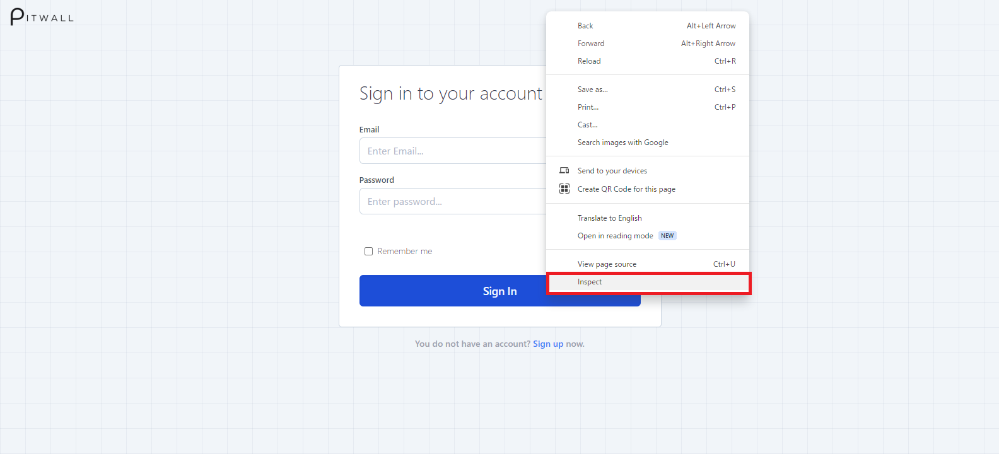</figure>

- Right-click on the highlighted part of the elements tab of devtools and select Copy Selector.
<figure>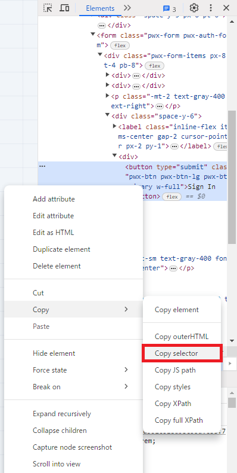</figure>

- Paste the selection made with Copy Selector into the [Value] field. (Paste it and it becomes `#__next > div.relative.w-full.h-screen.flex.flex-col.align-center.justify-center.pwx-auth-bg-color > div.flex.grow.pt-8.pb-16.items-start.justify-center.gap-2.overflow-scroll > div > div > form > div > div.space-y-6 > div > button`in this case).

<figure>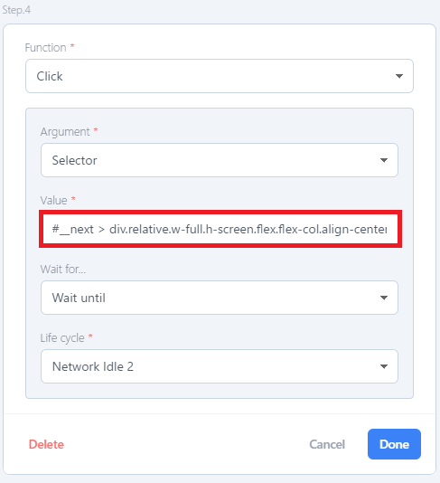</figure>

※ In the "Preview screen flow" URL field, enter your PITWALL URL, PITWALL email in the username field, and PITWALL password in the password field.




To automate searching for a service (Amazon Route 53) on AWS Health Dashboard (https://health.aws.amazon.com/health/status) and getting a screenshot.

**Step１: Accessing to URL**

1. Set [Function] to [Go to (Go to a specific page)].
2. Set [Argument] to [Built-in (Select from built-in)]. 
3. Set [Built-in variable] to [URL (Use generated URL)].
4. Set [Wait for] to [Wait until(Wait until a certain event)].
5. Set [Life Cycle] to [Network Idle 2(Network Idle2)]. 
6. Click on [Done].
<figure>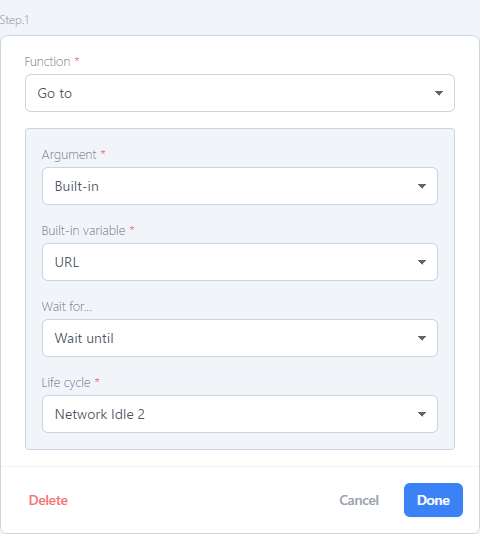</figure>

**Step２: Entering the Service or Region in the email field after transiting to the URL.**

1. Set [Function] to [Type (Simulate user's input activity)].
2. Set [Argument] to [XPath(XML path language)].
3. Set [Value] to `/html/body/div[2]/div/div[2]/div/div/main/div/div[2]/div[2]/div/div/div[1]/div[2]/div[2]/div[2]/div[1]/div/div[2]/div/div/div[1]/div/div[1]/div/div/div/div[1]/div/input` [※Refer to below for how to obtain value.](./#How to obtain [value])  
4. Set [Wait for] to [Wait until(Wait until a certain event)].    
5. Set [Life Cycle] to [Network Idle 2(Network Idle2)].      
6. Set [Argument] to [Static(Static value)].   
7. Set [Value] to [Service = Amazon Route 53].    
8. Click on [Done].
<figure>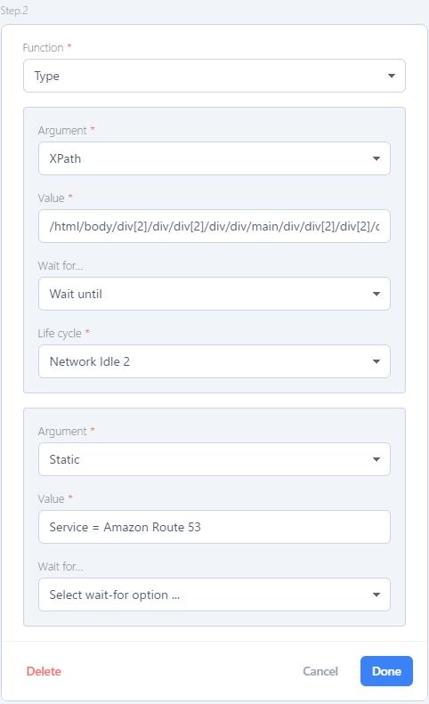</figure>

#### How to obtain [value]
-Open the AWS Health Dashboard (https://health.aws.amazon.com/health/status), right click in the search field and select [Verify].
<figure>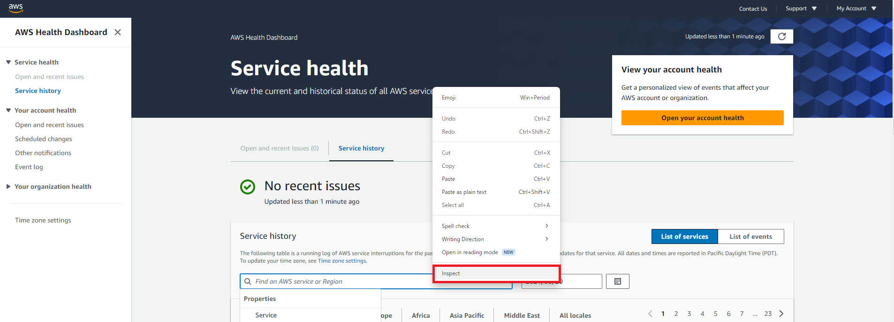</figure>

- Right click on the highlighted area in the elements tab of devtools and select Copy full XPath.
<figure>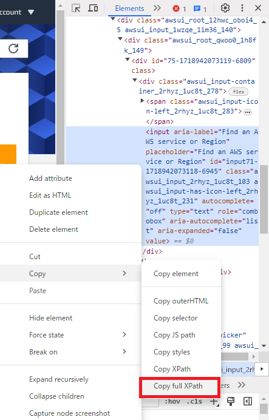</figure>

- Paste the selection made with Copy full XPath into the [Value] field.(Paste it and it becomes `/html/body/div[2]/div/div[2]/div/div/main/div/div[2]/div[2]/div/div/div[1]/div[2]/div[2]/div[2]/div[1]/div/div[2]/div/div/div[1]/div/div[1]/div/div/div/div[1]/div/input`in this case).

<figure>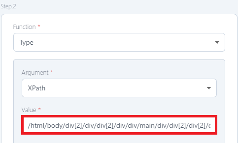</figure>
      

**Step３:  Click on enter key**

1. Set [Function] to 「Enter(Simulate enter key-press)」.
2. Click on [Done].

※ Enter the AWS Health Dashboard URL (https://health.aws.amazon.com/health/status) in the [Preview Screenshot Flow] URL field.




| Functions that can be set to the flow          | Descriptions                    |
| -                | -                       |
| Go to      | Go to a specific page        |
| Session Manager  | Establish secure tunnel to target host              | 
| Click | Simulate user's clicking activity |
| Type       | Simulate user's typing activity    |
| Wait for selector  | Wait for CSS selector             | 
| Wait for navigation | Wait for page navigation |
| Wait for timeout       | Wait for timeout     |
| Enter | Simulate enter key-press |
| Go to href    | Navigate to the URL specified in the href attribute of a tag    |
| Wait and click | Wait for selector and type              | 
| Wait and type | Wait for selector and type |
| Sleep       | Wait for until condition    |

| Arguments that can be set to Functions        | Descriptions                     |
| -                | -                       |
| Selector      | CSS Selector      |
| XPath  | XPath (XML path language)             | 
| Static | Static value|
| Built in     | Select from built-in   |
| Screenshot option extension   | Configured in screenshot settings

| Built-in variable         | Descriptions                        |
| -                | -                          |
| URL    | Use generated URL      |
| Username  | Set in screenshot settings                | 
| Password | Set in screenshot settings  |

| Wait for        | Descriptions                     |
| -                | -                       |
| Timeout     | Wait for timeout     |
| Wait until  | Wait until a certain event             | 

| Life cycle        | Descriptions                     |
| -                | -                       |
| Load     | Load      |
| Dom Content Loaded  | Dom content loaded (Option to use external resources such as images and style sheets without waiting for the complete page to load)   | 
| Network Idle 0     | Network Idle 0 (Wait at least 500 milliseconds until there is 0 network connection)|
| Network Idle 2  | Network Idle 2 (Wait at least 500 milliseconds until there are fewer than two network connections)            | 

