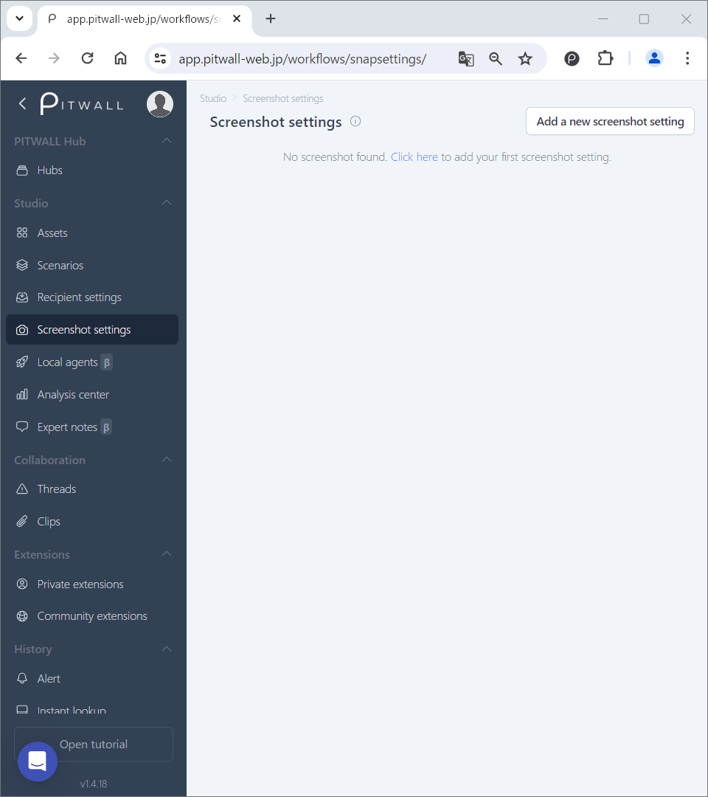
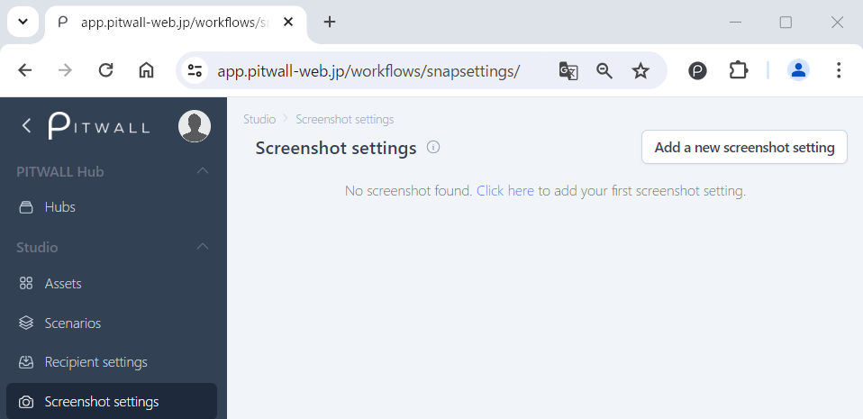
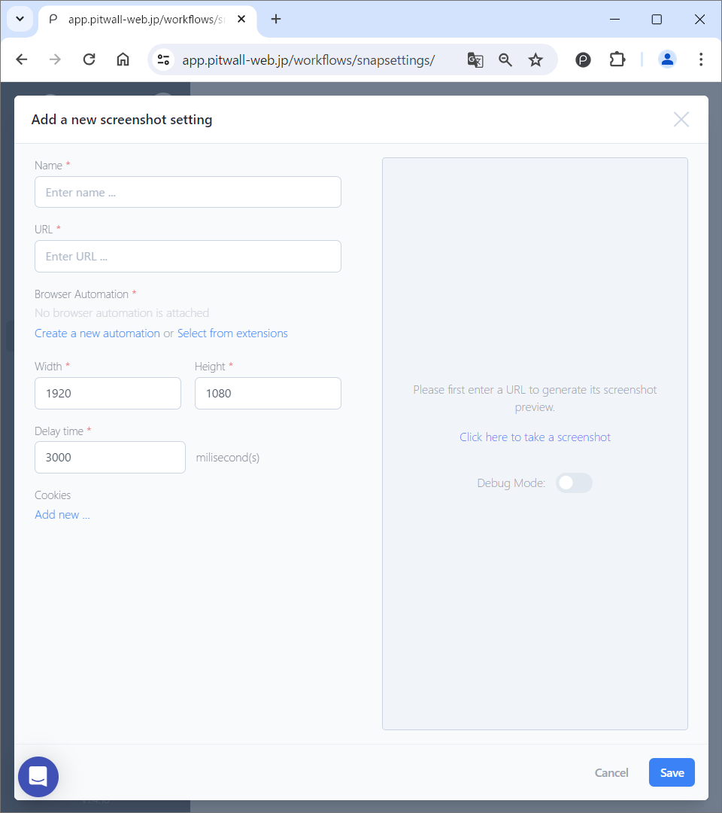

# Screenshot settings

## What is Screenshot?
By configuring a screenshot, you can take a screenshot of the site or tool that is set when the scenario is activated.

## How to use

The default screen will look like this.

<figure></figure>

### Register screenshot settings
Click the [Add a new screenshot setting] button in the top right.

<figure></figure>

#### Configure screenshot settings
Configure the screenshot setting information from [Add a new screenshot setting] on the modal window.

<figure></figure>

| Items | Descriptions |
| - | - |
| Name | Enter a name for the screenshot. |
| URL | Enter the URL of the web service screen from which you want to take a screenshot. |
| Browser Automation | By using automation, you can automatically fill in your authentication information. |
| Width, Height | Set the width and height of the screenshot you want to take. The default size is 1920 X 1080. |
| Delay time | Enter the wait time before taking a screenshot. The default value is 3000 milliseconds (3 seconds).|
| Cookies | Enter the cookie key-value in the key and value fields. If you want to set multiple cookies, click [Add new].
| Screenshot preview | You can see a preview of the screenshot you want to take. To take a screenshot, click [Click here to take a screenshot] on the right side of the screen. |

Click the [Save] button to complete the configuration.