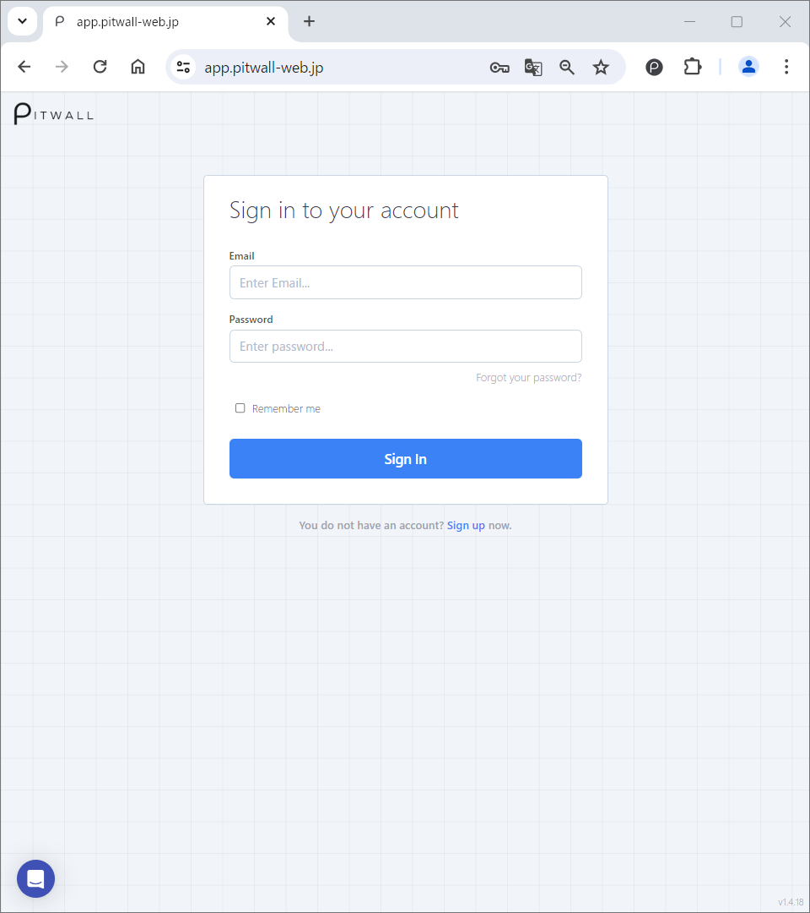

# Login / Logout

## Login
Access the PITWALL URL [https://app.pitwall-web.jp/](https://app.pitwall-web.jp/) from your browser.

<figure></figure>

From the [Sign in to your account] screen, enter your Email address and your password, then click [Sign In]. If you are taken to the [Home] page after signing in, your login has been successful.
  - By checking the [Remember me] checkbox, you can omit entering your Email address next time.

If you have enabled two-factor authentication, an authentication code will be sent to you via SMS or Email. Please enter the verification code sent to you. If you do not receive an authentication code, you can reissue a new code by clicking [Resend a new code].

If you have forgotten your password, you can reset your password from the [Sign in to your account] screen's [Forgot your password?].
  - Enter your Email address and click on [Reset my password].    You will receive an Email with a link to reset your password.
    Click on the link in the Email to reset your password.

## Logout
Click on the profile image in the upper left corner of the screen.

<figure></figure>

Click [Logout] from the pull-down menu. If you are redirected to the [Sign in to your account] screen, you have successfully logged out.