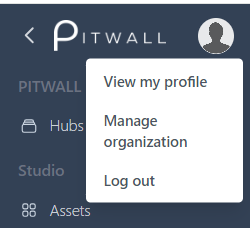
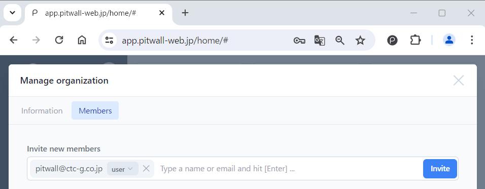

# Manage Organization
An organization refers to a tenant for each contract issued for using PITWALL.
Organization management allows you to manage organizations and members belonging to them.
This function can only be used by users with Admin privileges.

## Manage your organization
To manage your organization, select [Manage organization] from the profile image at the top left of the screen, and you will be redirected to the [Manage organization] screen.

<figure></figure>

### Information
Set the organization name and two-factor authentication.
- Name: If an organization name is set, the name of organization will be displayed.
You can change the organization name by [Update name] and entering the organization name of your choice.
This is a required field and cannot be saved without it being filled out.
- Enable two-factor authentication: Click the toggle switch to enable two-factor authentication using an EMail.

### Members
Manage users belonging to the organization.

#### Invite new members
Enter the Email address in the text field and press tab key to confirm.
Select either [Admin] or [User] for the privilege of the member from the pull-down list and click [Invite].
  - It is possible to invite multiple members at the same time.
  - An invitation Email will be sent to the Email address of the invited members, who will then click the link in the invitation Email to register their accounts.

<figure></figure>

#### Current members
A list of members belonging to the organization will be displayed.

Members: Displays the member's name and Email address.
  - Members with a blue check mark are organization administrators.
  - If [Invitation pending] is displayed, the invited user has not activated their PITWALL account. If invited user has not received the invitation email, you can click [Resend] to resend the invitation email.

Roles/Actions: Manage users and user privileges.
  - Admin: Has full access to anything in this project and can edit this organization.
  - User: Can add, edit and delete anything in this project and cannot edit this organization.
  - Transfer ownership: Assign the ownership of this organization to the chosen administrator.
  - Remove member: To remove a member.
      