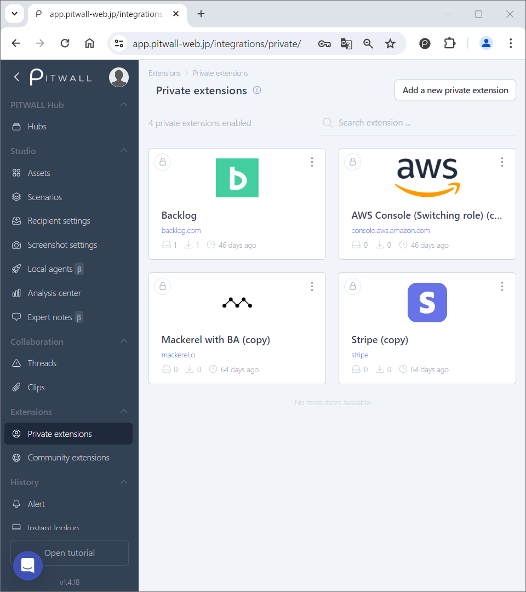

# Private extensions

Private extensions allow you to register the following information about web services used in assets.

The extension provides various contents like URLs, icons/logos, and timestamp formats. 

1. Enrich your Studio UI by adding Web Service icons.
2. Adding time format(s) to detect timestamps from the URL you would like to parameterize in the studio.
<figure></figure>

## Register private extensions

Click [Add a new private extension] in the upper right corner of the default screen.

<figure></figure>

On the [Add a new extension] window, register the following items.

| Items               | Descriptions  |
|---                 | --   |
|Name                |Enter any name to identify the extension.|
|URL                 |Enter the URL of the target Web service. ● This is used to identify the target web service when registering an asset.|
|Icon            |Upload the icon image of the target Web service. ● Available formats for icon images are jpeg, png, and ico.|
|Type              |You can choose between Private and Community. ● If you select Private, it will only be available within your user tenant. ● If you select Community, it will also be registered with the Community extension.This makes the same information available to PITWALL users and allows you to contribute to the PITWALL community.If you delete it from the Private extensions, it will also be deleted from the Community extensions.|
|Browser automation    |By using browser automation, you can create a new screenshot flow specifically for the target web service and create a template for the flow.|
|Time awareness  |You can choose [Yes] or [No]. ● If you select [Yes], you can add a time format to detect timestamp information from the parameterized URL. ● For timestamp information, select the [from] and [to] timestamp format from ISO format or UNIX format, and enter the value in the text box using regular expressions.|
|Delete                |If you no longer need the extension, you can delete it.|

