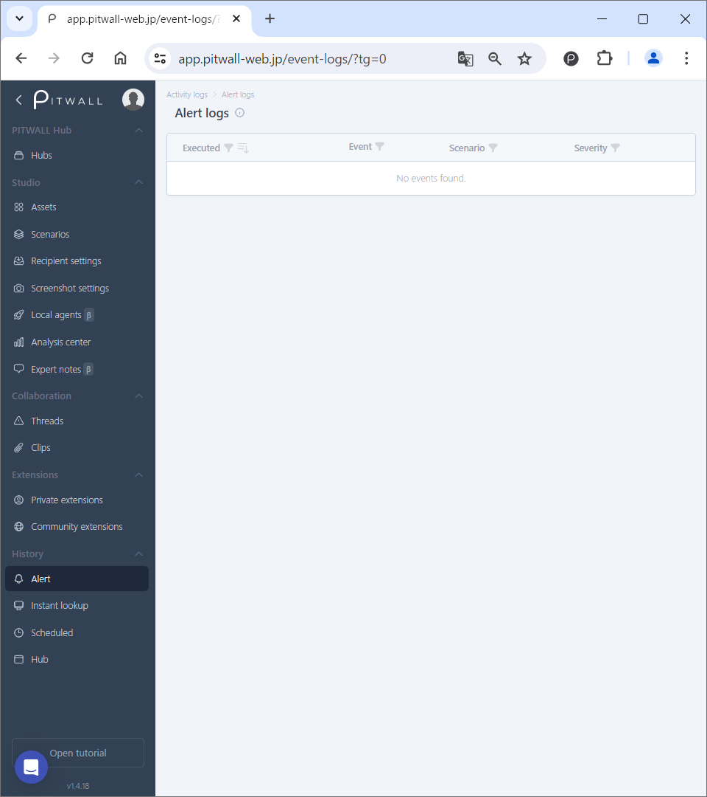
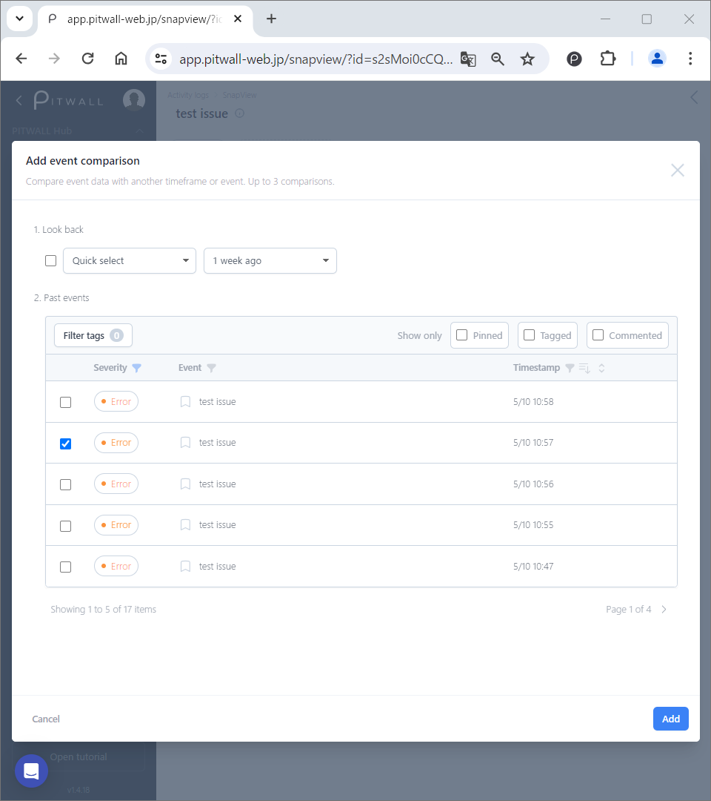
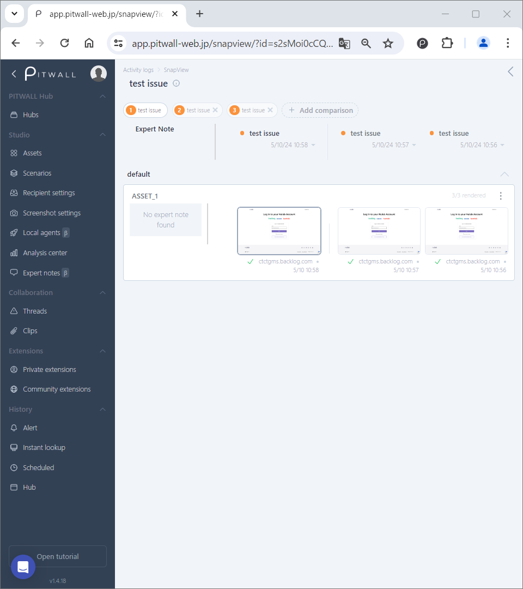

# Alert

## Alert Log
You can view the execution history of alert scenarios. The main uses are
viewing detailed information about alerts, comparing previous alert information,
and adding tags, comments, and annotations to alert information.
You can perform detailed analysis, and on the alert details screen, you can select and compare up to three alerts other than the target alert.

## How to use
The initial screen will look like this.

<figure></figure>

### Alert history
When an alert is generated and recorded in the history, the screen will look like this.

<figure></figure>

- Executed: Displays the date and time when the alert was executed.
  -  By clicking the icon, you can filter the execution date and time you want to display by date.
    - Enter the start date and time of the execution date and time you want to filter in [From], and the end date and time of the execution date and time you want to filter in [To], and click [Search]. *You can also select and enter the date and time from the calendar icon.
  -  By clicking the icon, you can change the order in which the execution dates are displayed from newest to oldest or from oldest to newest.
- Event: The name of the event that was executed is displayed.
  -  You can search for alerts by event title by clicking the icon.
    - Enter any keyword in the search box and click [Search].
- Scenario: The name of the executed scenario is displayed.
  -  You can search for a scenario by its name by clicking the icon.
      - Enter any keyword in the search box and click [Search].
- Severity: Displays the severity of the alert.
  -  You can search for alerts by event severity by clicking the icon.
      - Select the severity of the alert (All, Critical, Error, Warning, Info, Debug) and click [Search].

### Comparing Alert logs

The initial screen for comparing specific alert logs looks like this.

<figure></figure>

You can compare the alert log information with another time frame of alert information. You can add a previous alert for comparison by clicking [Add comparison]. (Up to four can be displayed.
You can add up to three comparisons.) To delete a comparison, click the x button to the right of the comparison you want to delete.

### Adding a previous alert to compare
Add alert information from [Add event comparison] on the modal window. You can add up to three comparison targets.

<figure></figure>

- Look back: Specify the event to be added from the past date and time for comparison.
  - Quick select: Select the past period to compare from the following options.
    - １ hour ago
    - １ day ago
    - １ week ago
    - １ month ago

  - Date and time: Specify the date and time of event to be compared
  
- Past events: Select a past event from the list. You can filter by (Severity, Event, Timestamp).
  - How to use filters
    - Severity: Displays the severity of the alert.
     You can filter by severity by clicking this icon  and specifying the severity of the alert (All, Critical, Error, Warning, Info, Debug).
    - Event: Display the event title of the alert.
     You can search by event title by clicking the icon  and specifying the event title.
    - Timestamp:
     You can filter by the date you want to display by clicking the icon  and specifying the [From/To] date and time.
     *You can also enter a date and time by selecting it from the calendar icon. By clicking the icon
       , you can change the order in which the execution dates are displayed from newest to oldest or from oldest to newest.

### Compared alerts will look like this

<figure></figure>

### How to add tags, comments, annotations, and pins to alert information
You can add pins, tags, and comments by hovering over the alert title. You can add pins, tags, comments, and annotations by hovering over the screenshot.
You can also update the screenshot, open the expanded view, open the annotation editor, and access the URL.

