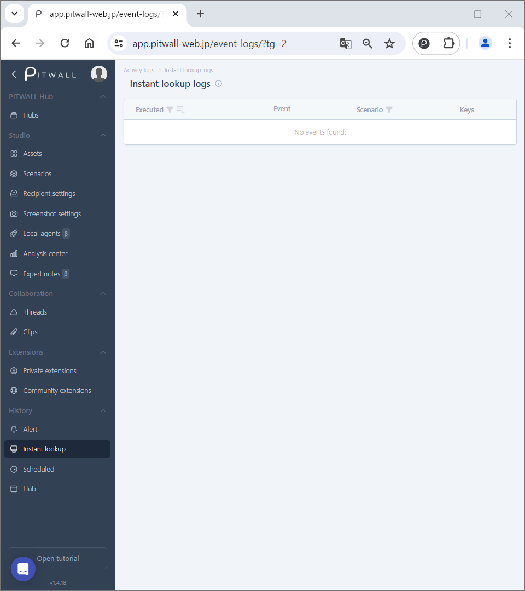
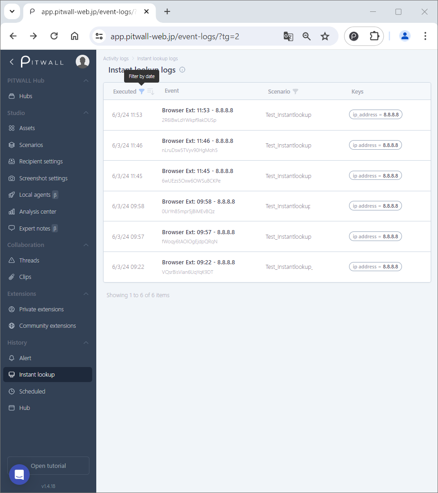

# Instant lookup logs

## What is an instant lookup logs?
Instant Lookup Logs contain the results of instant lookups, allowing you to easily view the screenshots retrieved for various purposes. The date and time of the events performed are saved and listed, which is very useful when you need to check the event information for a specific period.
There is also a function to add multiple past events for a specific period side by side in the same screen, which is useful for comparing multiple events.

### How to use an instant lookup log

The initial screen will look like this.

<figure></figure>

The history of instant lookups that were executed are listed like this.

<figure></figure>

| Items | Descriptions |
| - | - |
| Executed | Displays the executed data and time of an instant lookup. |
| Event | Information about the instant lookup. |
| Scenario | Name of the screnario on to which the instant lookup is added. |
| Key | The key value required to access the URL or a tool. |

You can filter by date by clicking the top left  icon.
You can view by date(oldest to newest) by clicking the top left  icon.

### How to check an instant lookup event information

On the list of instant lookup logs, you can click a particular instant lookup to display its detailed information. 

### To compare multiple past events
After displaying the event details, click [+ Add comparison] to select and add the past event you want to compare.
Multiple event information is displayed side by side on the same screen, making it convenient for comparing multiple events.