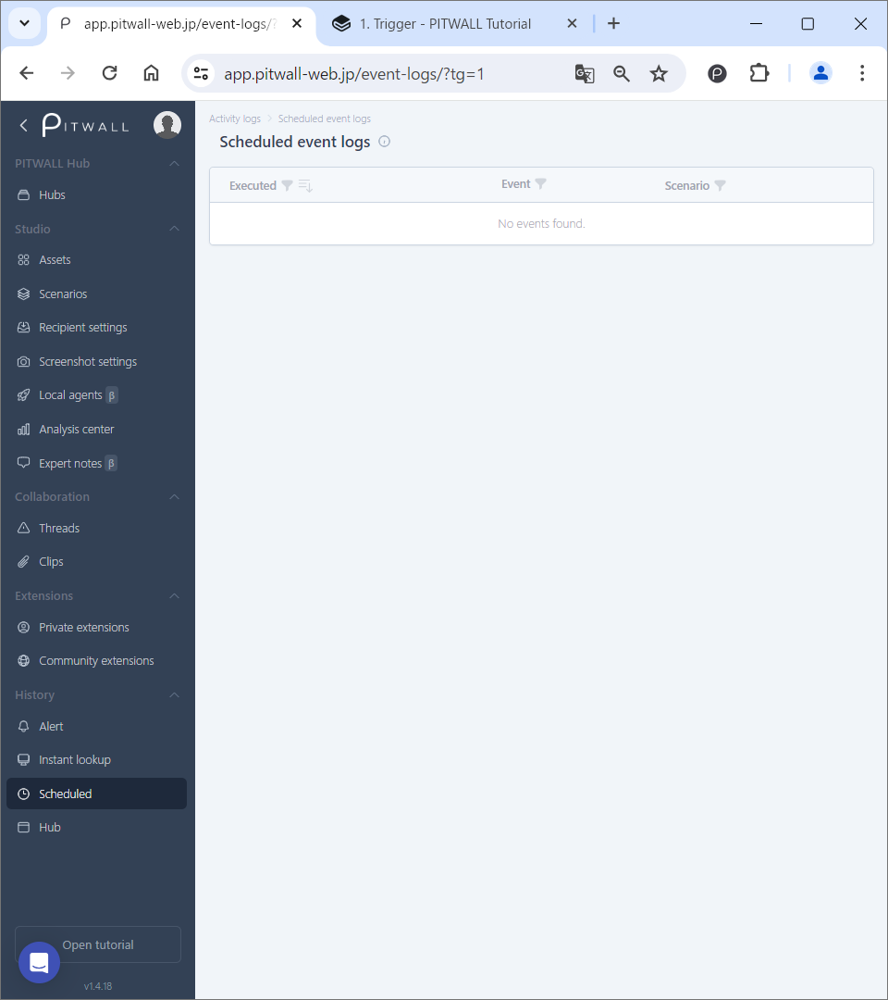
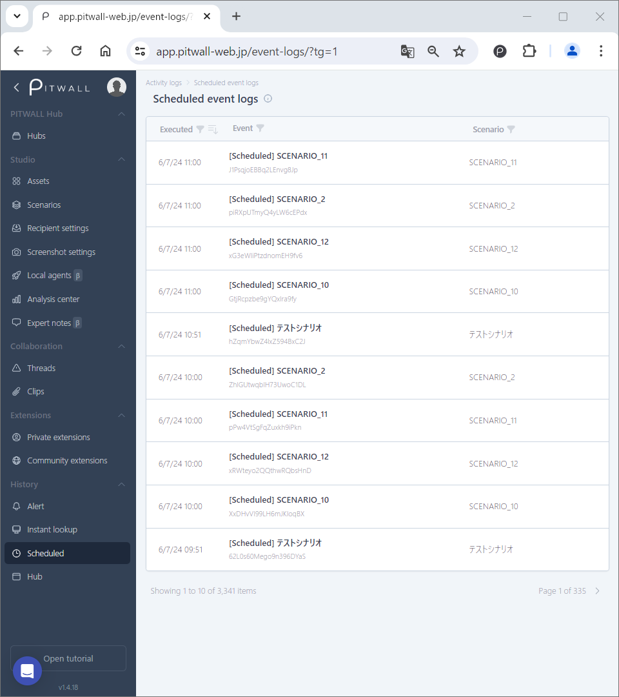
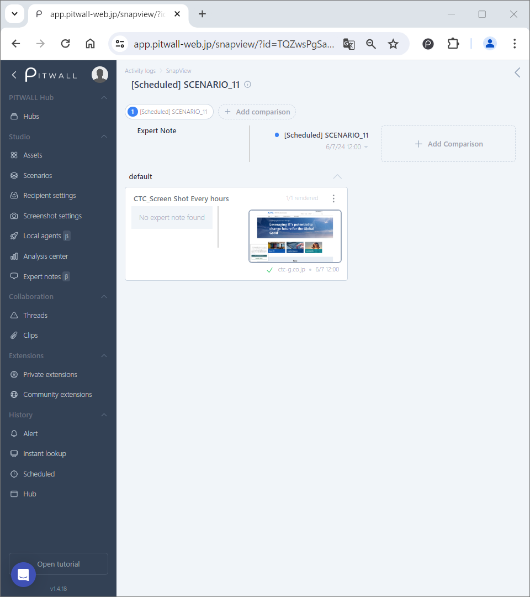
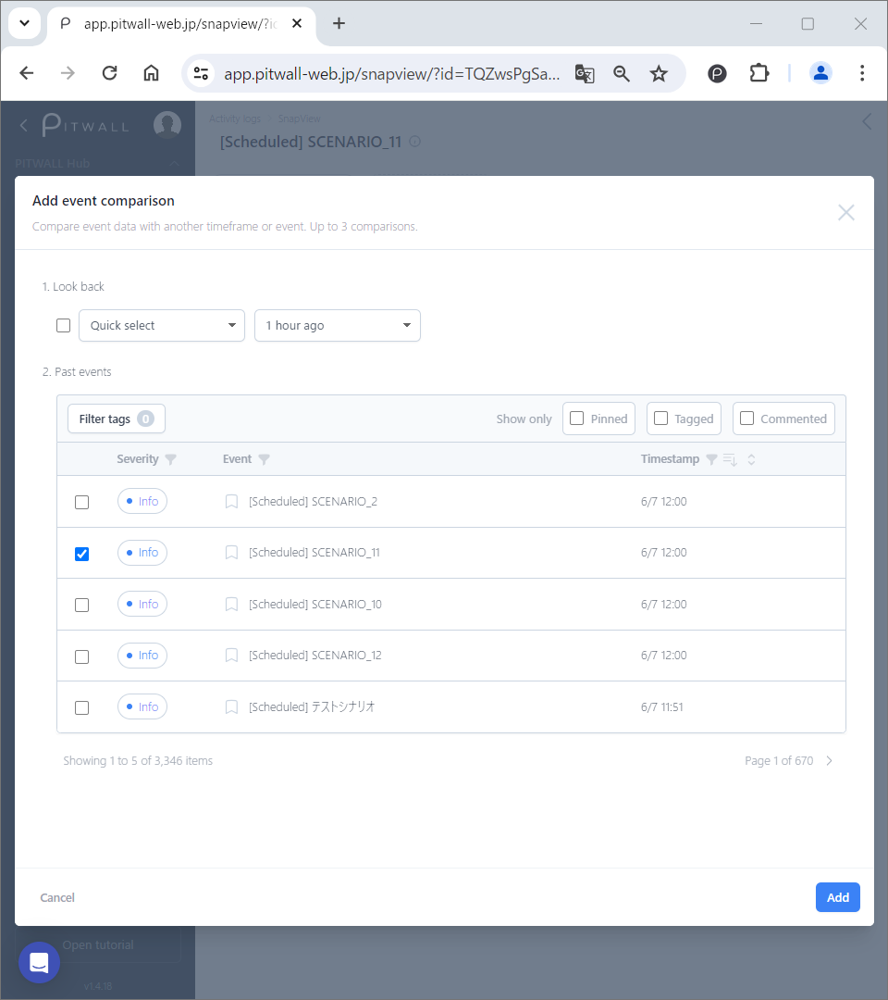

# Scheduled

## Scheduled event log
You can see events history of scheduled screnarios. This detailed views allows you to compare events, add tags, comments, annotations, and perform further analysis.

## How to use
The initial screen will look like this.

<figure></figure>

### Scheduled event history
When an scheduled event is run and recorded in the history, the screen will look like this.

<figure></figure>

- Executed: Displays the date and time when an event was executed.
  -  By clicking the icon, you can filter the executed date you want to display by date.
    - Enter the start date of the execution date you want to filter in [From], and the end date of the execution date you want to filter in [To], and click [Search]. *You can also select and enter the date from the calendar icon.
  -  By clicking the icon, you can change the order in which the execution dates are displayed from newest to oldest or from oldest to newest.
- Event: The name of the event that was executed is displayed.
  -  You can search for events by event title by clicking the icon.
    - Enter any keyword in the search box and click [Search].
- Scenario: The name of the executed scenario is displayed.
  -  You can search for a scenario by its name by clicking the icon.
      - Enter any keyword in the search box and click [Search].
  
### Comparing Event logs

The initial screen for comparing specific event logs looks like this.

<figure></figure>

You can compare the event information with another time frame of an event. You can add a previous event for comparison by clicking [Add comparison]. (Up to four can be displayed.
You can add up to three comparisons.) To delete a comparison, click the x button to the right of the comparison you want to delete.

#### Adding a previous event to compare
Add a previous event from [Add event comparison] on the modal window. You can add up to three comparison targets.

<figure></figure>

- Look back: Specify the event to be added from the past date for comparison.
  - Quick select: Select the past period to compare from the following options.
    - １ hour ago
    - １ day ago
    - １ week ago
    - １ month ago

  - Date and time: Specify the date and time of event to be compared.

### Compared scheduled events will look like this

<figure></figure>

### How to add tags, comments, annotations, and pins to event information
You can add pins, tags, and comments by hovering over the event title. You can add pins, tags, comments, and annotations by hovering over the screenshot.
You can also update the screenshot, open the expanded view, open the annotation editor, and access the URL.
