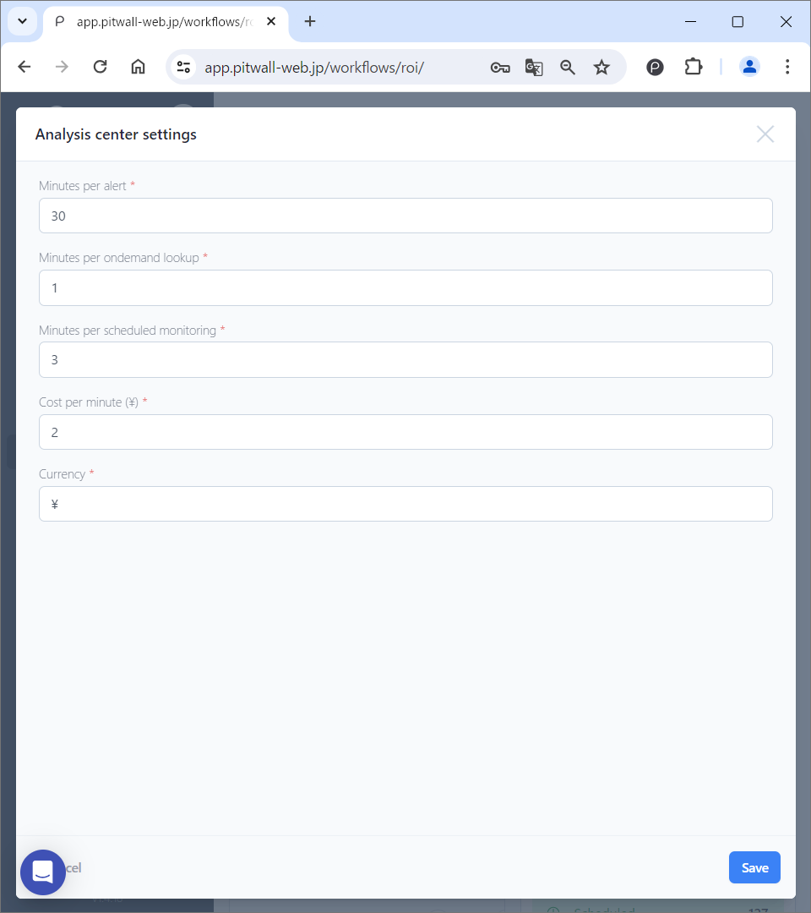

# Analysis center

## What is Analysis center?
When you use PITWALL, various data is accumulated. You can see the following data:

- Estimated workload saved
- Estimated cost saved
- Scenarios executed in total 
- Scenarios most executed 
- Scenario type trend

## How to use

The default screen will look like this.

<figure></figure>

### Viewing Historical data 
You can select the period of historical data you want to display using the pull-down list in the upper right corner of the screen.

### Manage settings
Click the [Manage settings] button to display a modal window where you can change settings. Usage data will be calculated based on the value set here.

<figure></figure>

- Minutes per alert
- Minutes per ondemand lookup
- Minutes per scheduled monitoring
- Cost per minute (The symbol of the set currency)
- Currency: The symbol of the currency you want to display (Ex: $,￥)
