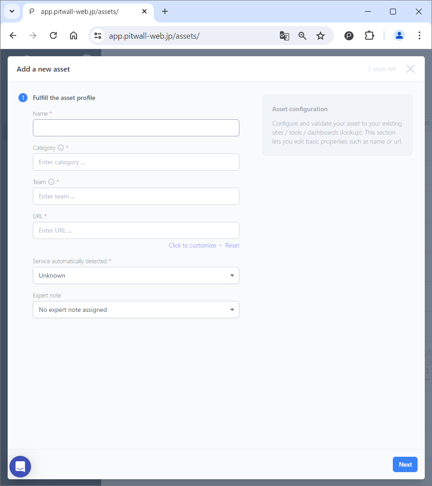

# Assets 

## What is Assets?
Assets allow you to predefine and register access and search conditions for each site used in PITWALL (web pages, monitoring tools, etc.). By using Asset, you can increase reusability.

## How to use

If you are using it for the first time, you will see a default screen like this.

<figure></figure>

### Register Asset
Click the [Add a new asset] button in the top right.

#### Enter Asset Information
Register the Asset's identification information from [#1 Fulfill in the asset profile] on the modal window.<!--Photo--> 
<figure></figure>

| Item                    | Description  |
| :-                       | :-     |
|Name                      |Give this asset a name that will help you find it quickly.|
|Category                |Define an arbitrary category name for classifying assets of the same type, including the target asset.（Ex:Trace, Log, Metric, etc.） ● After entering the desired category name, you will need to click on the [Add *category name* ...] that pops up to finalize the category name. ● If you register a category name, it will be displayed as a tab in the header of the initial screen.|
|Team                    |This is used to classify PITWALL when it is used by multiple teams or when the usage scenarios are different. ● After entering the desired team name, you must click [Add *Team name* ...] in the pop-up to finalize the team name.|
|URL                       |Enter the URL of the Web service you want to access.|
|Service automatically detected    | The information registered in the URL field will be matched with the URL of the service registered in the [Extensions] and the service will be automatically detected. By default, if there are any web services registered in [Community-extensions], they will be automatically detected.Other than that, only those that users have individually registered as [Private-extensions] are available.|

Click on the **[Next]** button.

### Configure Screenshot Settings
If you choose to take a screenshot, you'll be prompted to confirm your screenshot settings.
In that case, set the following items:
<figure></figure>

| Item                     | Description  |
| -                        | -     |
|Name                      |Give it a name so you can easily identify your screenshot settings.|
|URL                       |This is the URL of the web service screen from which you want to take a screenshot. ● The URL entered on the asset information input screen will be automatically reflected.|
|Browser automation          |By using automation, you can automatically fill in your authentication information when you access a page that requires authentication.For details, please refer to [Browser automation](tutorial-get-started/studio/screenshot-automation.md)|
|Local Agent      |Enables taking screenshots in the Local Agent.Local Agent is a desktop application that runs on your local machine and allows you to take screenshots of web services behind your firewall or on your local network. For details, please refer to [Local Agent](tutorial-get-started/local-agent.md)|
|Width, Height                  |Set the size of the screenshot you want to take. ● Depending on the web service or website, the information may be wide or require long vertical scrolling, so set it according to the size of the screen you are retrieving. ● The default is Full HD (1920x1080).|
|Delay time                  |Depending on the Web service, it may take some time for the screen to be displayed. ● Setting a wait time for such web services ensures that screenshots are taken correctly. ●The unit is milliseconds, so to wait 3 seconds, set it to 3000 milliseconds.|
|Cookies                   |Some web services use cookies when accessing the target URL. ● To ensure access to such services, register a set of keys and values.|
|Screenshot Validation  |Enables periodic health checks of screenshot settings. ● This feature allows us to regularly monitor browser screenshot automation and validation of credentials such as cookies, and notify users when necessary.|

### Check Asset
You can view or edit the assets, icons, or asset names you created by selecting [Edit this asset] from the three dots  on the right side.

<!--Photo--> 
<figure></figure>

### Delete Asset

For the asset you created, select [Delete this asset] from the three dots  on the right side.

If you are sure you want to delete it, click the Delete button to confirm.
<!--Photo--> 
<figure></figure>

## Organize Asset Information
Select [Group by Category] or [Group by Team] from the pull-down menu in the upper right.
You can sort by category or team name.
In addition, grouping tabs will be displayed above the asset information, and you can select any grouping tab to display only the target group.